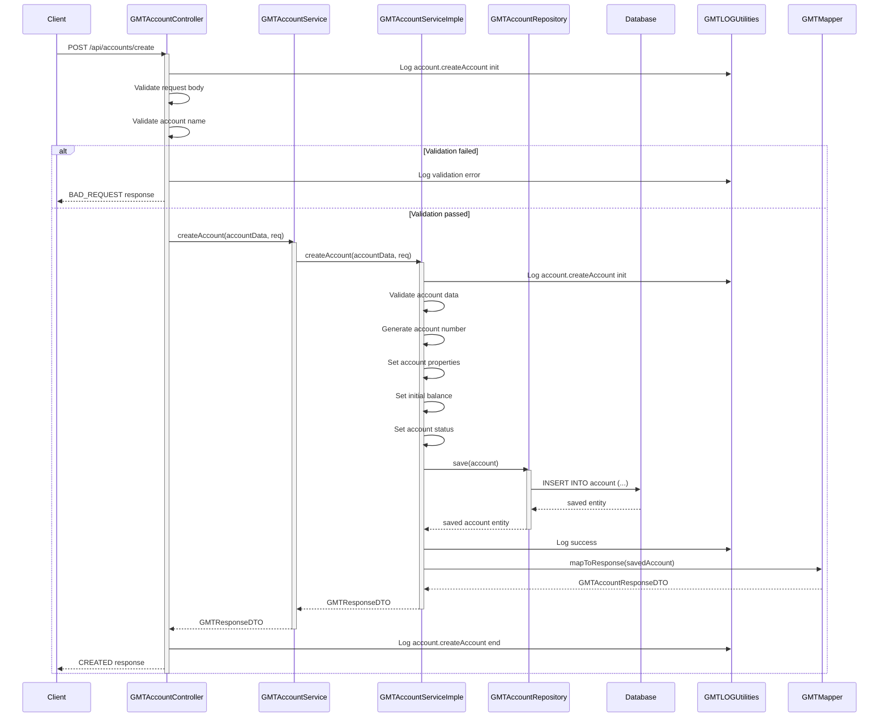
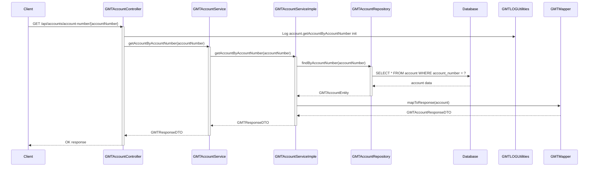
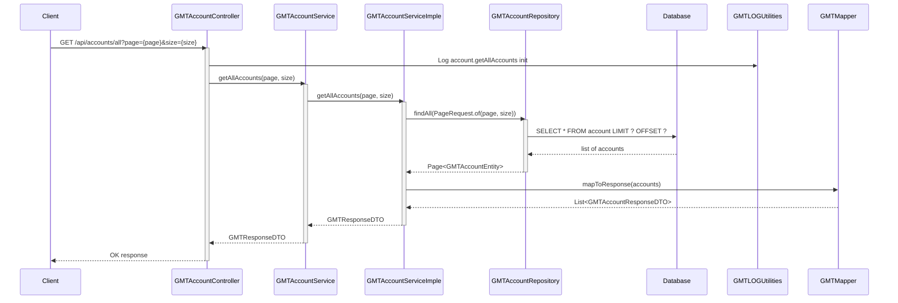
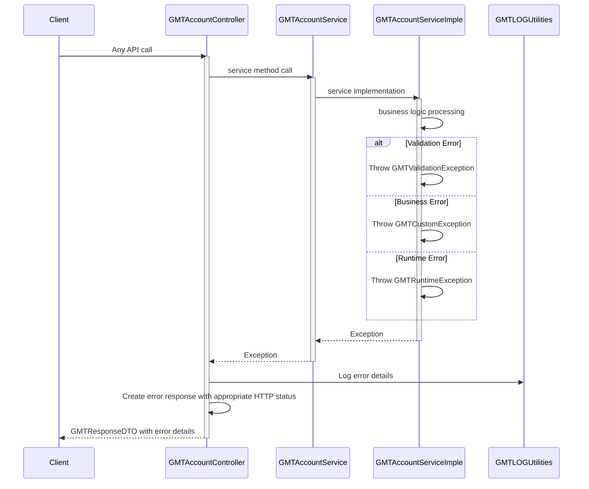

# Account Service Sequence Diagram

## System Architecture Overview

The account service follows a layered architecture with the following components:
- **GMTAccountController**: REST API endpoints for account operations
- **GMTAccountService**: Service interface defining account operations
- **GMTAccountServiceImple**: Service implementation with business logic
- **GMTAccountRepository**: Data access layer for account persistence
- **GMTAccountEntity**: Database entity for accounts
- **GMTLOGUtilities**: Logging utilities
- **GMTMapper**: Data transformation utilities
- **GMTHelper**: Helper utilities for account operations
- **ValidationService**: Input validation service

## Sequence Diagrams

### 1. Account Creation Flow



### 2. Get Account by ID Flow

```mermaid
sequenceDiagram
    participant Client
    participant Controller as GMTAccountController
    participant Service as GMTAccountService
    participant ServiceImpl as GMTAccountServiceImple
    participant Repository as GMTAccountRepository
    participant Database
    participant Logger as GMTLOGUtilities
    participant Mapper as GMTMapper

    Client->>Controller: GET /api/accounts/id/{id}
    activate Controller

    Controller->>Logger: Log account.getAccountById init
    Controller->>Service: getAccountById(id)
    activate Service

    Service->>ServiceImpl: getAccountById(id)
    activate ServiceImpl

    ServiceImpl->>Repository: findById(id)
    activate Repository
    Repository->>Database: SELECT * FROM account WHERE id = ?
    Database-->>Repository: account data
    Repository-->>ServiceImpl: GMTAccountEntity
    deactivate Repository

    alt Account found
        ServiceImpl->>Mapper: mapToResponse(account)
        Mapper-->>ServiceImpl: GMTAccountResponseDTO

        ServiceImpl-->>Service: GMTResponseDTO
        deactivate ServiceImpl

        Service-->>Controller: GMTResponseDTO
        deactivate Service

        Controller-->>Client: OK response
    else Account not found
        ServiceImpl->>ServiceImpl: Throw GMTCustomException
        ServiceImpl-->>Service: Exception
        deactivate ServiceImpl

        Service-->>Controller: Exception
        deactivate Service

        Controller-->>Client: NOT_FOUND response
    end
    deactivate Controller
```

### 3. Get Account by Account Number Flow



### 4. Update Account Balance Flow

```mermaid
sequenceDiagram
    participant Client
    participant Controller as GMTAccountController
    participant Service as GMTAccountService
    participant ServiceImpl as GMTAccountServiceImple
    participant Repository as GMTAccountRepository
    participant Database
    participant Logger as GMTLOGUtilities
    participant Mapper as GMTMapper

    Client->>Controller: PUT /api/accounts/balance
    activate Controller

    Controller->>Logger: Log account.updateBalance init
    Controller->>Service: updateBalance(balanceData, req)
    activate Service

    Service->>ServiceImpl: updateBalance(balanceData, req)
    activate ServiceImpl

    ServiceImpl->>Logger: Log account.updateBalance init
    ServiceImpl->>ServiceImpl: Validate balance data
    ServiceImpl->>ServiceImpl: Check account exists

    ServiceImpl->>Repository: findByAccountNumber(accountNumber)
    activate Repository
    Repository->>Database: SELECT * FROM account WHERE account_number = ?
    Database-->>Repository: account data
    Repository-->>ServiceImpl: GMTAccountEntity
    deactivate Repository

    alt Account found
        ServiceImpl->>ServiceImpl: Validate balance change
        ServiceImpl->>ServiceImpl: Update account balance
        ServiceImpl->>ServiceImpl: Set updated timestamp

        ServiceImpl->>Repository: save(account)
        activate Repository
        Repository->>Database: UPDATE account SET balance=?, updated_at=? WHERE id=?
        Database-->>Repository: updated entity
        Repository-->>ServiceImpl: updated account entity
        deactivate Repository

        ServiceImpl->>Logger: Log success
        ServiceImpl->>Mapper: mapToResponse(updatedAccount)
        Mapper-->>ServiceImpl: GMTAccountResponseDTO

        ServiceImpl-->>Service: GMTResponseDTO
        deactivate ServiceImpl

        Service-->>Controller: GMTResponseDTO
        deactivate Service

        Controller-->>Client: OK response
    else Account not found
        ServiceImpl->>ServiceImpl: Throw GMTCustomException
        ServiceImpl-->>Service: Exception
        deactivate ServiceImpl

        Service-->>Controller: Exception
        deactivate Service

        Controller-->>Client: NOT_FOUND response
    end
    deactivate Controller
```

### 5. Get All Accounts Flow



### 6. Account Status Update Flow

```mermaid
sequenceDiagram
    participant Client
    participant Controller as GMTAccountController
    participant Service as GMTAccountService
    participant ServiceImpl as GMTAccountServiceImple
    participant Repository as GMTAccountRepository
    participant Database
    participant Logger as GMTLOGUtilities
    participant Mapper as GMTMapper

    Client->>Controller: PUT /api/accounts/status
    activate Controller

    Controller->>Logger: Log account.updateStatus init
    Controller->>Service: updateAccountStatus(statusData, req)
    activate Service

    Service->>ServiceImpl: updateAccountStatus(statusData, req)
    activate ServiceImpl

    ServiceImpl->>Logger: Log account.updateStatus init
    ServiceImpl->>ServiceImpl: Validate status data
    ServiceImpl->>ServiceImpl: Check account exists

    ServiceImpl->>Repository: findByAccountNumber(accountNumber)
    activate Repository
    Repository->>Database: SELECT * FROM account WHERE account_number = ?
    Database-->>Repository: account data
    Repository-->>ServiceImpl: GMTAccountEntity
    deactivate Repository

    alt Account found
        ServiceImpl->>ServiceImpl: Validate status change
        ServiceImpl->>ServiceImpl: Update account status
        ServiceImpl->>ServiceImpl: Set updated timestamp

        ServiceImpl->>Repository: save(account)
        activate Repository
        Repository->>Database: UPDATE account SET status=?, updated_at=? WHERE id=?
        Database-->>Repository: updated entity
        Repository-->>ServiceImpl: updated account entity
        deactivate Repository

        ServiceImpl->>Logger: Log success
        ServiceImpl->>Mapper: mapToResponse(updatedAccount)
        Mapper-->>ServiceImpl: GMTAccountResponseDTO

        ServiceImpl-->>Service: GMTResponseDTO
        deactivate ServiceImpl

        Service-->>Controller: GMTResponseDTO
        deactivate Service

        Controller-->>Client: OK response
    else Account not found
        ServiceImpl->>ServiceImpl: Throw GMTCustomException
        ServiceImpl-->>Service: Exception
        deactivate ServiceImpl

        Service-->>Controller: Exception
        deactivate Service

        Controller-->>Client: NOT_FOUND response
    end
    deactivate Controller
```

### 7. Error Handling Flow



## Key Features

- **Account Management**: Create, read, update, and manage bank accounts
- **Balance Operations**: Update account balances with validation
- **Status Management**: Update account status (active, inactive, blocked, etc.)
- **Pagination**: Support for paginated account listings
- **Validation**: Comprehensive input validation and business rule enforcement
- **Error Handling**: Structured error handling with appropriate HTTP status codes
- **Logging**: Detailed logging for audit and debugging purposes
- **Security**: Role-based access control and input sanitization

## API Endpoints

| Method | Endpoint | Description |
|--------|----------|-------------|
| POST | `/api/accounts/create` | Create a new account |
| GET | `/api/accounts/id/{id}` | Get account by ID |
| GET | `/api/accounts/account-number/{accountNumber}` | Get account by account number |
| PUT | `/api/accounts/balance` | Update account balance |
| GET | `/api/accounts/all` | Get all accounts with pagination |
| PUT | `/api/accounts/status` | Update account status |

## Business Rules

- Account names are required and cannot be empty
- Account numbers are auto-generated and unique
- Balance updates require account existence validation
- Status changes are validated against allowed transitions
- All operations are logged for audit purposes
- Failed operations return appropriate error messages
