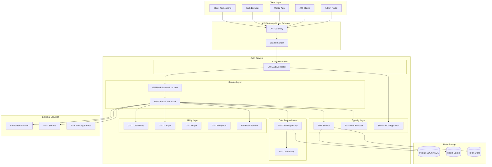
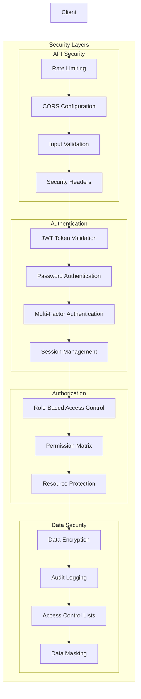
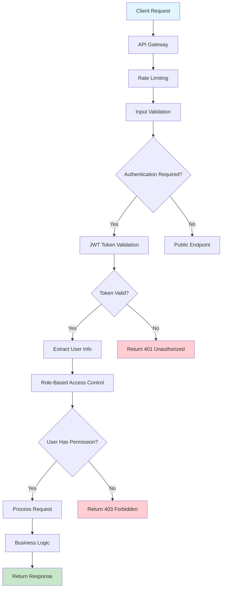
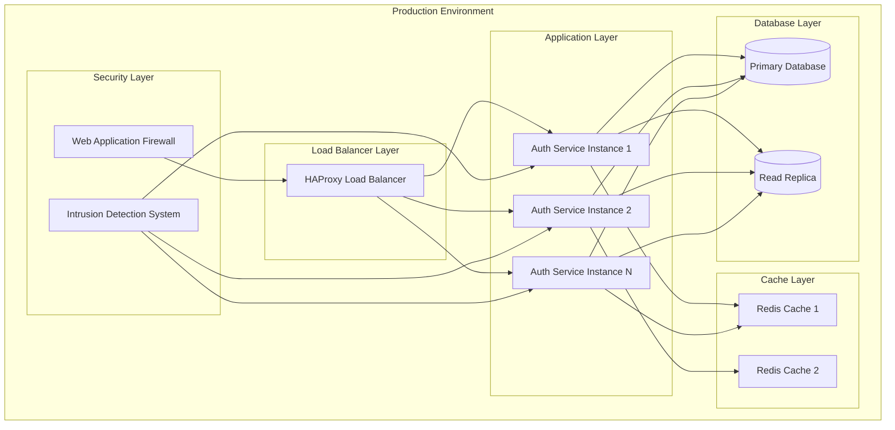

# Auth Service Architecture Overview

## System Architecture Diagram

## Component Responsibilities

### 1. Controller Layer
- **GMTAuthController**: Handles authentication HTTP requests
  - Login endpoint management
  - User registration
  - Token refresh
  - User updates
  - Request validation and sanitization

### 2. Service Layer
- **GMTAuthService**: Interface defining authentication operations
- **GMTAuthServiceImple**: Business logic implementation
  - User authentication and validation
  - Password security management
  - JWT token generation and validation
  - Account security (locking, failed attempts)

### 3. Data Access Layer
- **GMTAuthRepository**: User data persistence operations
  - User CRUD operations
  - Custom queries for authentication
  - Transaction management
- **GMTUserEntity**: User database entity mapping
  - JPA annotations for table mapping
  - Security-related fields
  - Audit fields (created_at, updated_at, last_login)

### 4. Security Layer
- **JWTService**: JWT token management
  - Access token generation
  - Refresh token generation
  - Token validation and parsing
- **PasswordEncoder**: Password security
  - BCrypt password hashing
  - Password verification
- **SecurityConfig**: Security configuration
  - CORS settings
  - Rate limiting
  - Security headers

### 5. Utility Layer
- **GMTLOGUtilities**: Security event logging
- **GMTMapper**: Data transformation utilities
- **GMTHelper**: Authentication helpers
- **GMTException**: Custom exception handling
- **ValidationService**: Input validation and sanitization

## Security Architecture

## Authentication Flow Architecture

## Performance & Scalability

### 1. Caching Strategy
- **Redis Cache**: User session data, rate limiting
- **Token Caching**: JWT token validation results
- **User Data Caching**: Frequently accessed user information

### 2. Scalability Features
- **Horizontal Scaling**: Multiple auth service instances
- **Load Balancing**: Distributed authentication requests
- **Database Sharding**: User data distribution
- **Stateless Design**: JWT-based stateless authentication

### 3. Performance Monitoring
- **Authentication Metrics**: Login success/failure rates
- **Response Time**: Token generation and validation times
- **Resource Utilization**: CPU, memory, database connections
- **Security Metrics**: Failed attempts, account lockouts

## Deployment Architecture

## Technology Stack

### 1. Backend Framework
- **Spring Boot**: Main application framework
- **Spring Security**: Security framework
- **Spring Data JPA**: Data access layer
- **Spring Validation**: Input validation

### 2. Security Technologies
- **JWT**: JSON Web Token implementation
- **BCrypt**: Password hashing algorithm
- **Spring Security**: Authentication and authorization
- **OAuth2**: OAuth 2.0 implementation (if needed)

### 3. Database & Caching
- **PostgreSQL/MySQL**: User data storage
- **Redis**: Session and token caching
- **Hibernate**: ORM framework

### 4. Monitoring & Security
- **SLF4J**: Logging facade
- **Micrometer**: Metrics collection
- **Spring Boot Actuator**: Health monitoring
- **Security Headers**: Security header management

## API Security Patterns

### 1. Authentication Endpoints
- **Login**: Secure password validation
- **Registration**: Input validation and sanitization
- **Token Refresh**: Secure token renewal
- **Logout**: Token invalidation

### 2. Security Headers
- **CORS**: Cross-origin resource sharing
- **CSP**: Content Security Policy
- **HSTS**: HTTP Strict Transport Security
- **X-Frame-Options**: Clickjacking protection

### 3. Rate Limiting
- **IP-based Limiting**: Per-IP request limits
- **User-based Limiting**: Per-user request limits
- **Endpoint Limiting**: Specific endpoint protection
- **Burst Protection**: Sudden traffic spike protection

## Business Rules Implementation

### 1. User Registration
- **Unique Constraints**: Username and email uniqueness
- **Password Requirements**: Strong password policies
- **Email Verification**: Email address validation
- **Account Activation**: Pending status management

### 2. Authentication Security
- **Failed Attempt Tracking**: Login attempt monitoring
- **Account Locking**: Automatic account suspension
- **IP Tracking**: Login location monitoring
- **Device Tracking**: User agent logging

### 3. Session Management
- **Token Expiration**: Configurable token lifetimes
- **Refresh Token Rotation**: Secure token renewal
- **Concurrent Sessions**: Multiple device support
- **Session Invalidation**: Secure logout process

## Integration Points

### 1. External Services
- **Notification Service**: Email and SMS notifications
- **Audit Service**: Security event logging
- **Rate Limiting Service**: Request throttling
- **Monitoring Service**: Performance monitoring

### 2. Data Synchronization
- **User Profile Sync**: Profile data synchronization
- **Permission Sync**: Role and permission updates
- **Security Event Sync**: Security incident sharing
- **Audit Log Sync**: Compliance logging

## Compliance & Security

### 1. Regulatory Compliance
- **GDPR**: Data privacy compliance
- **SOX**: Financial compliance
- **PCI DSS**: Payment card security
- **Banking Regulations**: Financial institution compliance

### 2. Security Standards
- **OWASP**: Web application security
- **NIST**: Cybersecurity framework
- **ISO 27001**: Information security management
- **SOC 2**: Security and availability controls

### 3. Audit Requirements
- **Access Logging**: User access tracking
- **Security Events**: Security incident logging
- **Change Tracking**: Configuration change history
- **Compliance Reporting**: Regulatory compliance reports

## Disaster Recovery

### 1. Backup Strategy
- **Database Backups**: User data backup
- **Configuration Backups**: Security configuration
- **Token Store Backups**: Active session backup
- **Log Backups**: Security event logs

### 2. Recovery Procedures
- **Service Recovery**: Authentication service restart
- **Database Recovery**: User data restoration
- **Token Recovery**: Session token restoration
- **Security Recovery**: Security configuration restoration

### 3. Business Continuity
- **Failover Systems**: Backup authentication services
- **Data Replication**: Real-time data synchronization
- **Service Degradation**: Graceful security degradation
- **Incident Response**: Security incident handling
