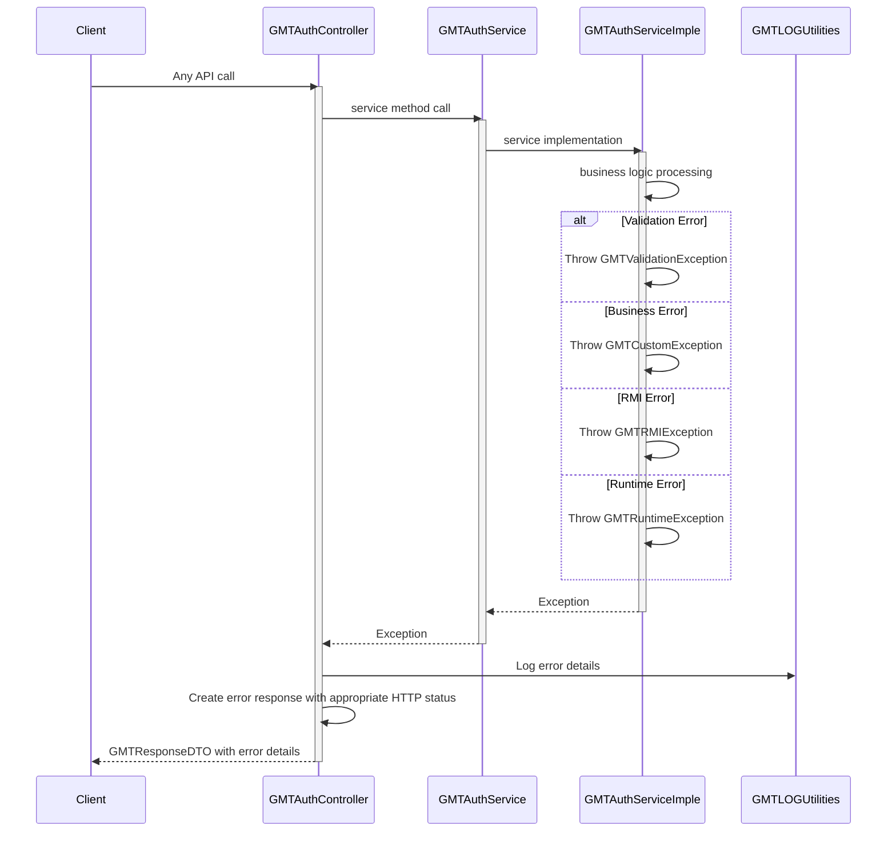

# Auth Service Sequence Diagram

## System Architecture Overview

The auth service follows a layered architecture with the following components:
- **GMTAuthController**: REST API endpoints for authentication operations
- **GMTAuthService**: Service interface defining authentication operations
- **GMTAuthServiceImple**: Service implementation with business logic
- **GMTAuthRepository**: Data access layer for user persistence
- **GMTUserEntity**: Database entity for users
- **GMTLOGUtilities**: Logging utilities
- **GMTMapper**: Data transformation utilities
- **JWTService**: JWT token generation and validation
- **PasswordEncoder**: Password encryption and validation
- **ValidationService**: Input validation service
- **NotificationService**: Email and notification services

## Sequence Diagrams

### 1. User Login Flow

```mermaid
sequenceDiagram
    participant Client
    participant Controller as GMTAuthController
    participant Service as GMTAuthService
    participant ServiceImpl as GMTAuthServiceImple
    participant Repository as GMTAuthRepository
    participant Database
    participant Logger as GMTLOGUtilities
    participant JWTService
    participant PasswordEncoder
    participant NotificationService

    Client->>Controller: POST /api/auth/login
    activate Controller

    Controller->>Controller: Extract IP address, device info, user agent
    Controller->>Logger: Log auth.authenticate init
    Controller->>Service: authenticate(loginData, ipAddress, userAgent)
    activate Service

    Service->>ServiceImpl: authenticate(loginData, ipAddress, userAgent)
    activate ServiceImpl

    ServiceImpl->>Logger: Log auth.authenticate init
    ServiceImpl->>ServiceImpl: Validate login credentials
    ServiceImpl->>ServiceImpl: Check if user exists

    ServiceImpl->>Repository: findByUsername(username)
    activate Repository
    Repository->>Database: SELECT * FROM users WHERE username = ?
    Database-->>Repository: user data
    Repository-->>ServiceImpl: GMTUserEntity
    deactivate Repository

    alt User found
        ServiceImpl->>PasswordEncoder: matches(password, encodedPassword)
        PasswordEncoder-->>ServiceImpl: password match result

        alt Password correct
            ServiceImpl->>ServiceImpl: Check account status
            ServiceImpl->>ServiceImpl: Check if account is locked

            alt Account active
                ServiceImpl->>JWTService: generateAccessToken(user)
                JWTService-->>ServiceImpl: access token

                ServiceImpl->>JWTService: generateRefreshToken(user)
                JWTService-->>ServiceImpl: refresh token

                ServiceImpl->>ServiceImpl: Update last login timestamp
                ServiceImpl->>ServiceImpl: Log successful login

                ServiceImpl->>Repository: save(user)
                activate Repository
                Repository->>Database: UPDATE users SET last_login=?, login_count=? WHERE id=?
                Database-->>Repository: updated entity
                Repository-->>ServiceImpl: updated user entity
                deactivate Repository

                ServiceImpl->>NotificationService: sendLoginNotification(user, ipAddress)
                NotificationService-->>ServiceImpl: notification sent

                ServiceImpl->>ServiceImpl: Create response with tokens
                ServiceImpl-->>Service: GMTResponseDTO
                deactivate ServiceImpl

                Service-->>Controller: GMTResponseDTO
                deactivate Service

                Controller-->>Client: OK response with tokens
            else Account locked
                ServiceImpl->>ServiceImpl: Throw GMTCustomException - Account locked
                ServiceImpl-->>Service: Exception
                deactivate ServiceImpl

                Service-->>Controller: Exception
                deactivate Service

                Controller-->>Client: UNAUTHORIZED response
            end
        else Password incorrect
            ServiceImpl->>ServiceImpl: Increment failed login attempts
            ServiceImpl->>ServiceImpl: Check if account should be locked

            alt Should lock account
                ServiceImpl->>ServiceImpl: Lock account
                ServiceImpl->>Repository: save(user)
                activate Repository
                Repository->>Database: UPDATE users SET status='LOCKED', locked_at=? WHERE id=?
                Database-->>Repository: updated entity
                Repository-->>ServiceImpl: updated user entity
                deactivate Repository
            end

            ServiceImpl->>ServiceImpl: Throw GMTCustomException - Invalid credentials
            ServiceImpl-->>Service: Exception
            deactivate ServiceImpl

            Service-->>Controller: Exception
            deactivate Service

            Controller-->>Client: UNAUTHORIZED response
        end
    else User not found
        ServiceImpl->>ServiceImpl: Throw GMTCustomException - User not found
        ServiceImpl-->>Service: Exception
        deactivate ServiceImpl

        Service-->>Controller: Exception
        deactivate Service

        Controller-->>Client: NOT_FOUND response
    end
    deactivate Controller
```

### 2. User Registration Flow

```mermaid
sequenceDiagram
    participant Client
    participant Controller as GMTAuthController
    participant Service as GMTAuthService
    participant ServiceImpl as GMTAuthServiceImple
    participant Repository as GMTAuthRepository
    participant Database
    participant Logger as GMTLOGUtilities
    participant PasswordEncoder
    participant NotificationService
    participant Mapper as GMTMapper

    Client->>Controller: POST /api/auth/register
    activate Controller

    Controller->>Controller: Extract IP address, user agent
    Controller->>Logger: Log auth.registerUser init
    Controller->>Service: registerUser(registrationData, createdBy)
    activate Service

    Service->>ServiceImpl: registerUser(registrationData, createdBy)
    activate ServiceImpl

    ServiceImpl->>Logger: Log auth.registerUser init
    ServiceImpl->>ServiceImpl: Validate registration data
    ServiceImpl->>ServiceImpl: Check if username already exists

    ServiceImpl->>Repository: findByUsername(username)
    activate Repository
    Repository->>Database: SELECT * FROM users WHERE username = ?
    Database-->>Repository: user data
    Repository-->>ServiceImpl: GMTUserEntity or null
    deactivate Repository

    alt Username exists
        ServiceImpl->>ServiceImpl: Throw GMTCustomException - Username already exists
        ServiceImpl-->>Service: Exception
        deactivate ServiceImpl

        Service-->>Controller: Exception
        deactivate Service

        Controller-->>Client: CONFLICT response
    else Username available
        ServiceImpl->>ServiceImpl: Check if email already exists

        ServiceImpl->>Repository: findByEmail(email)
        activate Repository
        Repository->>Database: SELECT * FROM users WHERE email = ?
        Database-->>Repository: user data
        Repository-->>ServiceImpl: GMTUserEntity or null
        deactivate Repository

        alt Email exists
            ServiceImpl->>ServiceImpl: Throw GMTCustomException - Email already exists
            ServiceImpl-->>Service: Exception
            deactivate ServiceImpl

            Service-->>Controller: Exception
            deactivate Service

            Controller-->>Client: CONFLICT response
        else Email available
            ServiceImpl->>ServiceImpl: Create new user entity
            ServiceImpl->>ServiceImpl: Set user properties
            ServiceImpl->>ServiceImpl: Generate user ID

            ServiceImpl->>PasswordEncoder: encode(password)
            PasswordEncoder-->>ServiceImpl: encoded password

            ServiceImpl->>ServiceImpl: Set encoded password
            ServiceImpl->>ServiceImpl: Set account status to PENDING
            ServiceImpl->>ServiceImpl: Set creation timestamp

            ServiceImpl->>Repository: save(user)
            activate Repository
            Repository->>Database: INSERT INTO users (...)
            Database-->>Repository: saved entity
            Repository-->>ServiceImpl: saved user entity
            deactivate Repository

            ServiceImpl->>NotificationService: sendWelcomeEmail(user)
            NotificationService-->>ServiceImpl: email sent

            ServiceImpl->>Logger: Log user registered successfully
            ServiceImpl->>Mapper: mapToResponse(user)
            Mapper-->>ServiceImpl: GMTUserResponseDTO

            ServiceImpl-->>Service: GMTResponseDTO
            deactivate ServiceImpl

            Service-->>Controller: GMTResponseDTO
            deactivate Service

            Controller-->>Client: CREATED response
        end
    end
    deactivate Controller
```

### 3. Token Refresh Flow

```mermaid
sequenceDiagram
    participant Client
    participant Controller as GMTAuthController
    participant Service as GMTAuthService
    participant ServiceImpl as GMTAuthServiceImple
    participant Repository as GMTAuthRepository
    participant Database
    participant Logger as GMTLOGUtilities
    participant JWTService
    participant Mapper as GMTMapper

    Client->>Controller: POST /api/auth/refresh
    activate Controller

    Controller->>Logger: Log auth.refreshToken init
    Controller->>Service: refreshToken(refreshTokenData, req)
    activate Service

    Service->>ServiceImpl: refreshToken(refreshTokenData, req)
    activate ServiceImpl

    ServiceImpl->>Logger: Log auth.refreshToken init
    ServiceImpl->>ServiceImpl: Validate refresh token
    ServiceImpl->>JWTService: validateRefreshToken(refreshToken)
    JWTService-->>ServiceImpl: token validation result

    alt Token valid
        ServiceImpl->>JWTService: extractUserFromToken(refreshToken)
        JWTService-->>ServiceImpl: user information

        ServiceImpl->>Repository: findById(userId)
        activate Repository
        Repository->>Database: SELECT * FROM users WHERE id = ?
        Database-->>Repository: user data
        Repository-->>ServiceImpl: GMTUserEntity
        deactivate Repository

        alt User found
            ServiceImpl->>ServiceImpl: Check if user is active
            ServiceImpl->>ServiceImpl: Check if refresh token is not expired

            alt User active and token valid
                ServiceImpl->>JWTService: generateNewAccessToken(user)
                JWTService-->>ServiceImpl: new access token

                ServiceImpl->>JWTService: generateNewRefreshToken(user)
                JWTService-->>ServiceImpl: new refresh token

                ServiceImpl->>Mapper: mapToResponse(user, newAccessToken, newRefreshToken)
                Mapper-->>ServiceImpl: GMTAuthResponseDTO

                ServiceImpl-->>Service: GMTResponseDTO
                deactivate ServiceImpl

                Service-->>Controller: GMTResponseDTO
                deactivate Service

                Controller-->>Client: OK response with new tokens
            else User inactive
                ServiceImpl->>ServiceImpl: Throw GMTCustomException - User account inactive
                ServiceImpl-->>Service: Exception
                deactivate ServiceImpl

                Service-->>Controller: Exception
                deactivate Service

                Controller-->>Client: UNAUTHORIZED response
            end
        else User not found
            ServiceImpl->>ServiceImpl: Throw GMTCustomException - User not found
            ServiceImpl-->>Service: Exception
            deactivate ServiceImpl

            Service-->>Controller: Exception
            deactivate Service

            Controller-->>Client: NOT_FOUND response
        end
    else Token invalid
        ServiceImpl->>ServiceImpl: Throw GMTCustomException - Invalid refresh token
        ServiceImpl-->>Service: Exception
        deactivate ServiceImpl

        Service-->>Controller: Exception
        deactivate Service

        Controller-->>Client: UNAUTHORIZED response
    end
    deactivate Controller
```

### 4. User Update Flow

```mermaid
sequenceDiagram
    participant Client
    participant Controller as GMTAuthController
    participant Service as GMTAuthService
    participant ServiceImpl as GMTAuthServiceImple
    participant Repository as GMTAuthRepository
    participant Database
    participant Logger as GMTLOGUtilities
    participant PasswordEncoder
    participant Mapper as GMTMapper

    Client->>Controller: PUT /api/auth/update
    activate Controller

    Controller->>Logger: Log auth.updateUser init
    Controller->>Service: updateUser(updateData, req)
    activate Service

    Service->>ServiceImpl: updateUser(updateData, req)
    activate ServiceImpl

    ServiceImpl->>Logger: Log auth.updateUser init
    ServiceImpl->>ServiceImpl: Validate update data
    ServiceImpl->>ServiceImpl: Check if user exists

    ServiceImpl->>Repository: findById(userId)
    activate Repository
    Repository->>Database: SELECT * FROM users WHERE id = ?
    Database-->>Repository: user data
    Repository-->>ServiceImpl: GMTUserEntity
    deactivate Repository

    alt User found
        ServiceImpl->>ServiceImpl: Validate update permissions
        ServiceImpl->>ServiceImpl: Update user properties
        ServiceImpl->>ServiceImpl: Set updated timestamp

        alt Password changed
            ServiceImpl->>PasswordEncoder: encode(newPassword)
            PasswordEncoder-->>ServiceImpl: encoded password

            ServiceImpl->>ServiceImpl: Set encoded password
        end

        ServiceImpl->>Repository: save(user)
        activate Repository
        Repository->>Database: UPDATE users SET ... WHERE id=?
        Database-->>Repository: updated entity
        Repository-->>ServiceImpl: updated user entity
        deactivate Repository

        ServiceImpl->>Logger: Log user updated successfully
        ServiceImpl->>Mapper: mapToResponse(updatedUser)
        Mapper-->>ServiceImpl: GMTUserResponseDTO

        ServiceImpl-->>Service: GMTResponseDTO
        deactivate ServiceImpl

        Service-->>Controller: GMTResponseDTO
        deactivate Service

        Controller-->>Client: OK response
    else User not found
        ServiceImpl->>ServiceImpl: Throw GMTCustomException - User not found
        ServiceImpl-->>Service: Exception
        deactivate ServiceImpl

        Service-->>Controller: Exception
        deactivate Service

        Controller-->>Client: NOT_FOUND response
    end
    deactivate Controller
```

### 5. Error Handling Flow



## Key Features

- **Authentication**: Secure user login with password validation
- **User Registration**: New user account creation with validation
- **Token Management**: JWT access and refresh token generation
- **Security**: Account locking after failed attempts, IP tracking
- **Password Security**: Encrypted password storage and validation
- **Session Management**: Last login tracking and device information
- **Notifications**: Welcome emails and login notifications
- **Error Handling**: Comprehensive error handling with appropriate HTTP status codes
- **Logging**: Detailed logging for audit and security monitoring
- **Input Validation**: Comprehensive input validation and sanitization

## API Endpoints

| Method | Endpoint | Description |
|--------|----------|-------------|
| POST | `/api/auth/login` | User authentication |
| POST | `/api/auth/register` | User registration |
| POST | `/api/auth/refresh` | Refresh access token |
| PUT | `/api/auth/update` | Update user information |

## Security Features

- **Password Encryption**: BCrypt password hashing
- **JWT Tokens**: Secure token-based authentication
- **Account Locking**: Automatic account locking after failed attempts
- **IP Tracking**: Login attempt tracking by IP address
- **Device Tracking**: User agent and device information logging
- **Session Management**: Secure session handling with refresh tokens
- **Input Validation**: Comprehensive input sanitization
- **Audit Logging**: Detailed security event logging

## Business Rules

- Usernames and emails must be unique
- Passwords are encrypted before storage
- Failed login attempts increment counter
- Accounts are locked after multiple failed attempts
- Refresh tokens are validated before generating new access tokens
- All authentication events are logged for security monitoring
- User updates require proper validation and permissions
