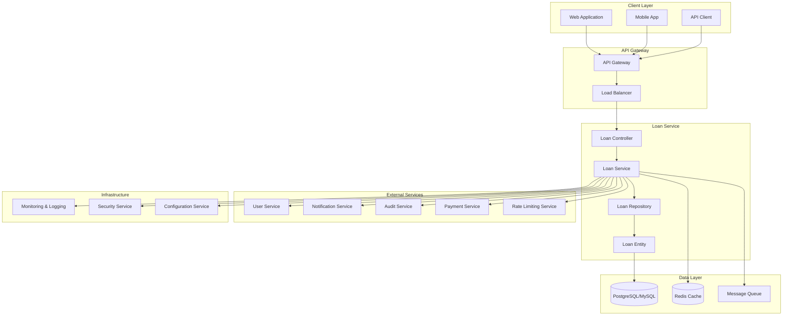
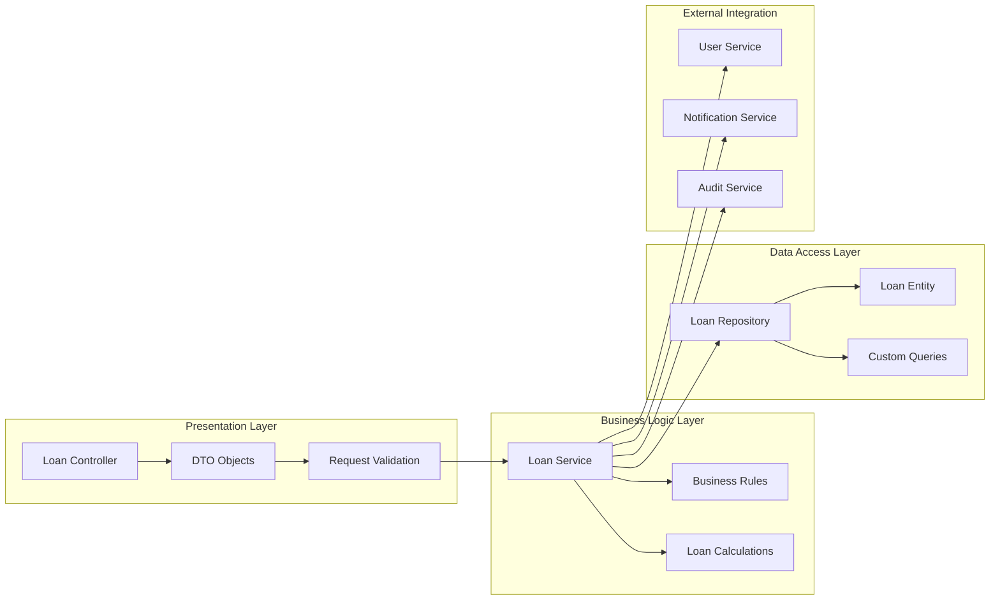
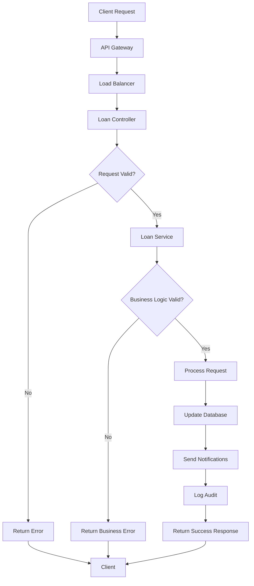
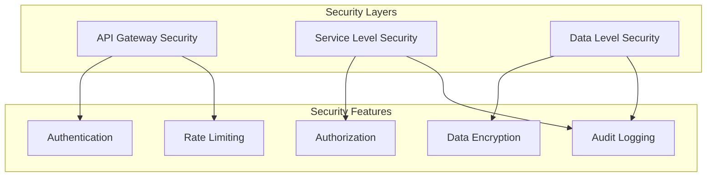
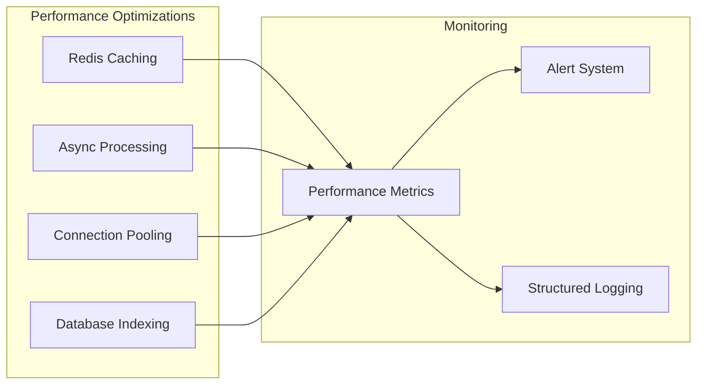
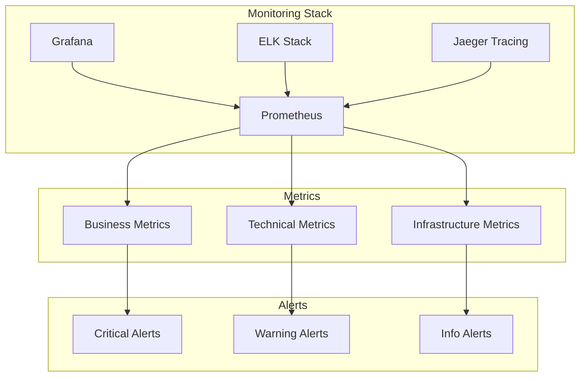
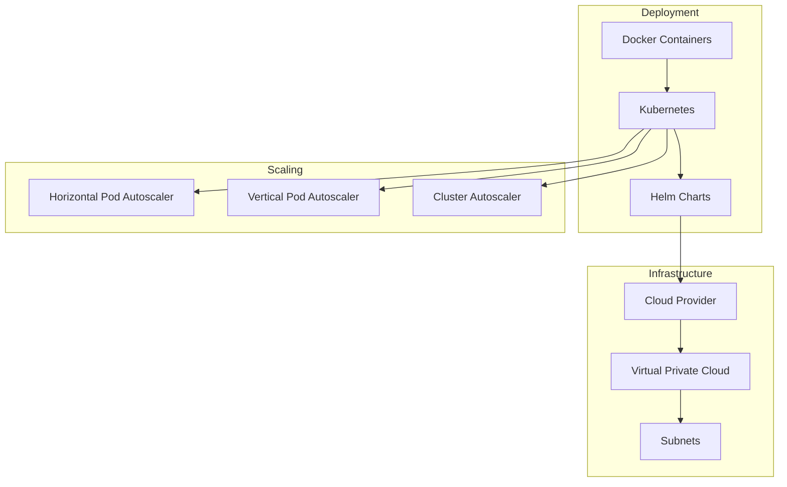

# Loan Service - Зээлийн үйлчилгээ Architecture

Энэ файл нь Loan Service-ийн системийн архитектурын ерөнхий харагдах байдлыг тайлбарлана.

## 1. Системийн архитектурын диаграм

## 2. Үйлчилгээний давхарга (Service Layers)

## 3. Бүрэлдэхүүн хэсгүүдийн хариуцлага

### Controller Layer
- **Хүсэлтийг хүлээн авах**: HTTP request-үүдийг хүлээн авах
- **Хүсэлтийг баталгаажуулах**: Request validation
- **Хариу буцаах**: Response formatting
- **Алдааны боловсруулалт**: Error handling

### Service Layer
- **Бизнес логик**: Зээлийн дүрэм, тооцоолол
- **Хүсэлтийг боловсруулах**: Request processing
- **Гадаад үйлчилгээтэй холбогдох**: External service integration
- **Аудит**: Audit logging

### Repository Layer
- **Өгөгдлийн хандалт**: Data access
- **CRUD үйлдлүүд**: Create, Read, Update, Delete
- **Хайлтын функцүүд**: Search functions
- **Өгөгдлийн баталгаажуулалт**: Data validation

## 4. Өгөгдлийн урсгал (Data Flow)

## 5. Аюулгүй байдлын онцлогууд

## 6. Гүйцэтгэлийн хэмжээ (Performance Considerations)

## 7. Хяналт, мэдээлэл (Monitoring & Observability)

## 8. Суулгац, ашиглалт (Deployment Architecture)

## Үндсэн онцлогууд

### Технологийн стек
- **Backend**: Spring Boot, Java
- **Database**: PostgreSQL/MySQL
- **Cache**: Redis
- **Message Queue**: Apache Kafka/RabbitMQ
- **Container**: Docker
- **Orchestration**: Kubernetes
- **Monitoring**: Prometheus, Grafana, ELK Stack

### Архитектурын зарчим
- **Microservices**: Тусдаа үйлчилгээ
- **Layered Architecture**: Давхаргатай архитектур
- **Separation of Concerns**: Хариуцлагын тусгаарлалт
- **SOLID Principles**: SOLID зарчим
- **Event-Driven**: Үйл явдалд суурилсан

### Аюулгүй байдал
- **JWT Authentication**: JWT токен
- **Role-Based Access**: Эрхэд суурилсан хандалт
- **Rate Limiting**: Хурдны хязгаарлалт
- **Audit Logging**: Аудит бүртгэл
- **Data Encryption**: Өгөгдлийн шифрлэлт

