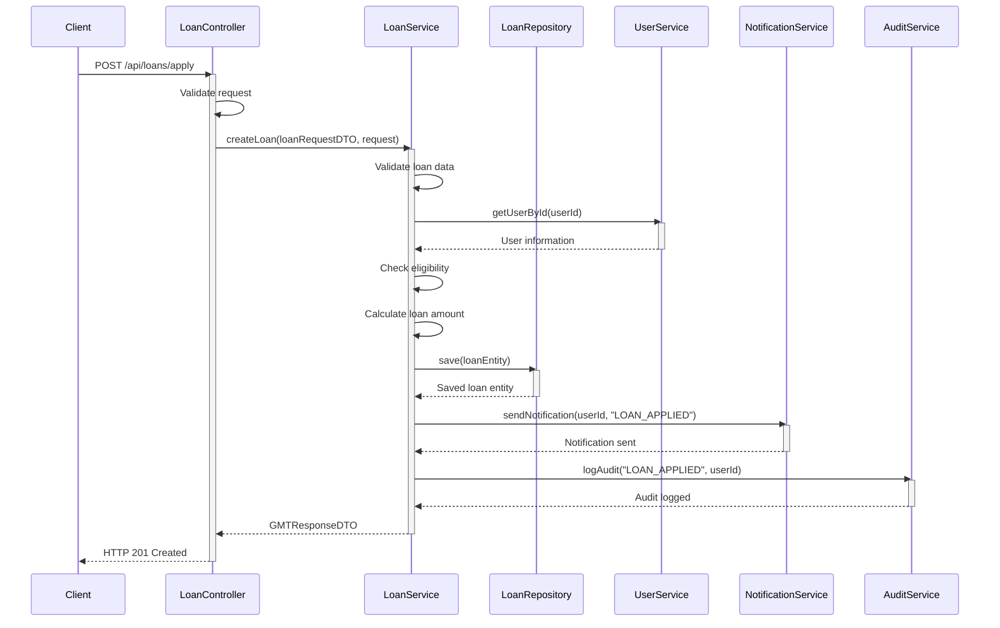
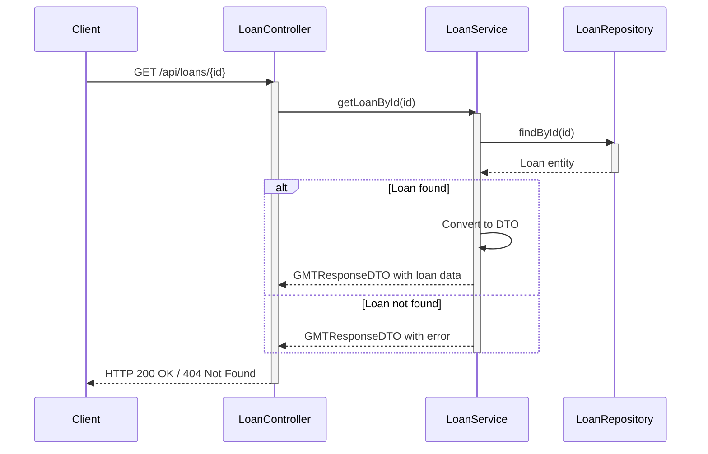
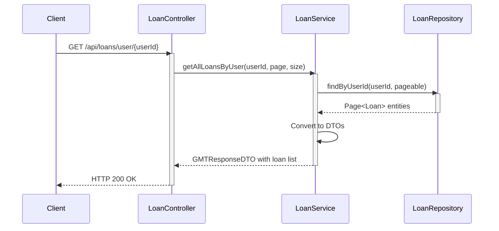
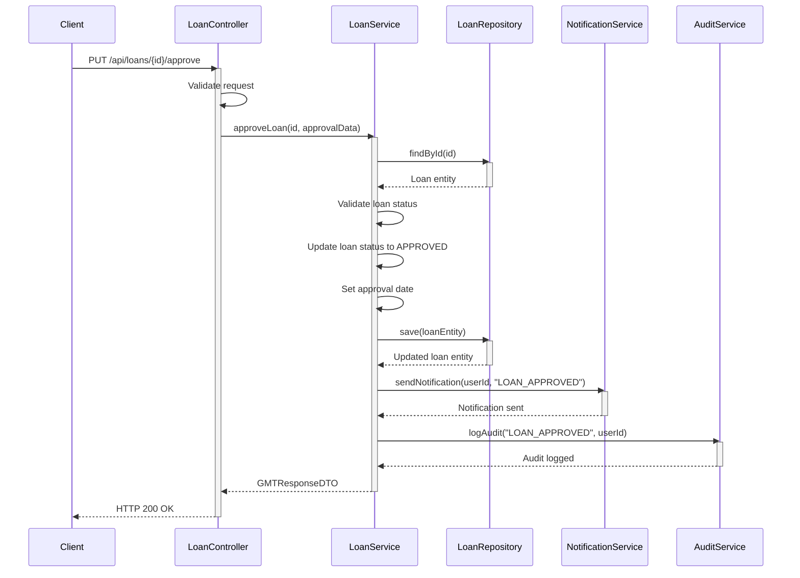
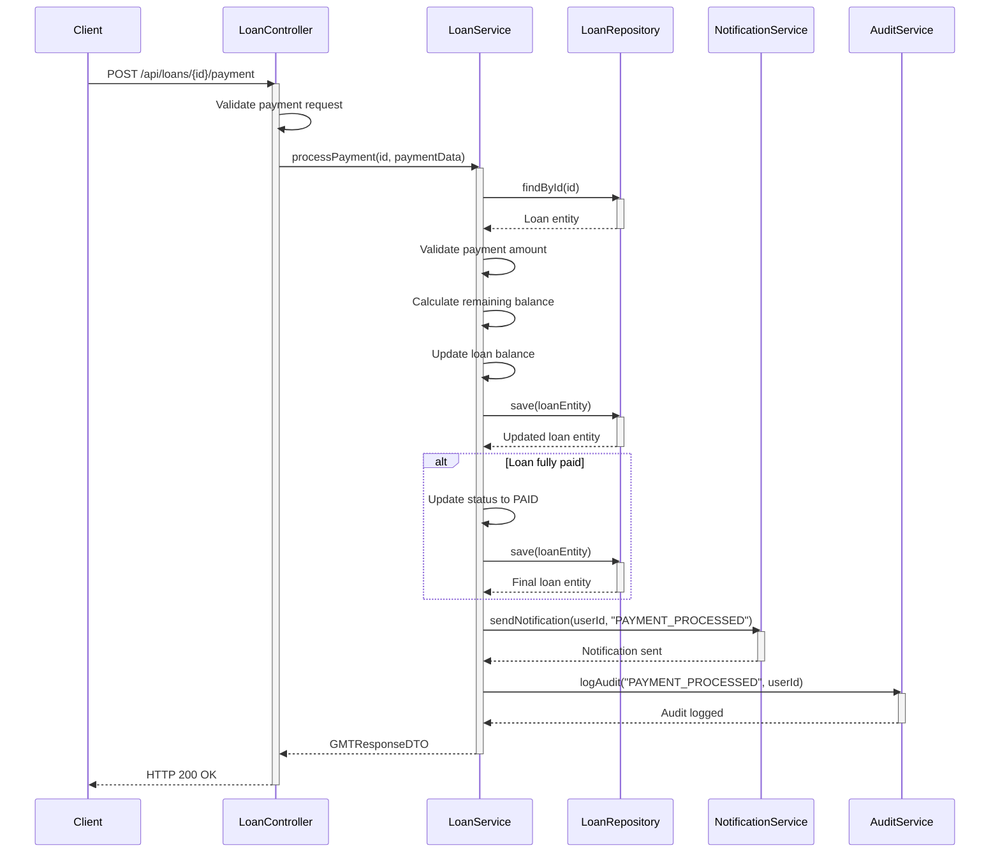
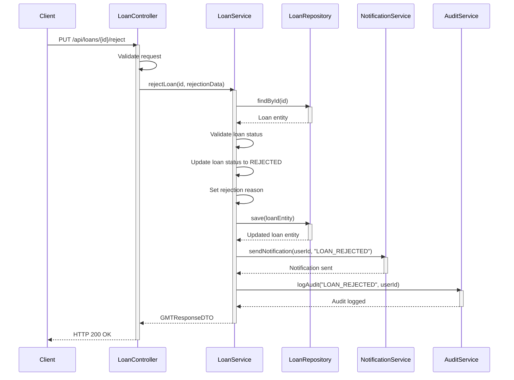

# Loan Service - Зээлийн үйлчилгээ Sequence Diagrams

Энэ файл нь Loan Service-ийн үндсэн бизнес процессуудын sequence diagram-уудыг агуулна.

## 1. Зээл хүсэх (Loan Application)



## 2. Зээлийн мэдээлэл авах (Get Loan by ID)



## 3. Хэрэглэгчийн бүх зээлүүд (Get All Loans by User)



## 4. Зээл батлах (Loan Approval)



## 5. Зээлийн төлбөр төлөх (Loan Payment Processing)



## 6. Зээл татгалзах (Loan Rejection)



## 7. Алдааны боловсруулалт (Error Handling)

```mermaid
sequenceDiagram
    participant Client
    participant LoanController
    participant LoanService
    participant UserService
    participant LoanRepository

    Client->>LoanController: POST /api/loans/apply
    activate LoanController
    
    LoanController->>LoanController: Validate request
    alt Invalid request data
        LoanController-->>Client: HTTP 400 Bad Request
        deactivate LoanController
    else Valid request
        LoanController->>LoanService: createLoan(loanRequestDTO, request)
        activate LoanService
        
        LoanService->>LoanService: Validate loan data
        alt Validation error
            LoanService-->>LoanController: GMTValidationException
            deactivate LoanService
            LoanController-->>Client: HTTP 400 Bad Request
            deactivate LoanController
        else Business logic error
            LoanService->>UserService: getUserById(userId)
            activate UserService
            UserService-->>LoanService: User not found
            deactivate UserService
            
            LoanService-->>LoanController: GMTBusinessException
            deactivate LoanService
            LoanController-->>Client: HTTP 404 Not Found
            deactivate LoanController
        else System error
            LoanService->>LoanRepository: save(loanEntity)
            activate LoanRepository
            LoanRepository-->>LoanService: Database error
            deactivate LoanRepository
            
            LoanService-->>LoanController: GMTCustomException
            deactivate LoanService
            LoanController-->>Client: HTTP 500 Internal Server Error
            deactivate LoanController
        end
    end
```

## Үндсэн онцлогууд

- **Зээлийн хүсэлт**: Хэрэглэгчийн эрх, зээлийн хэмжээг тооцоолох
- **Зээлийн батлалт**: Админ эрхээр зээлийг батлах
- **Төлбөр төлөлт**: Зээлийн төлбөрийг боловсруулах
- **Мэдээлэл**: Хэрэглэгчид мэдэгдэх
- **Аудит**: Бүх үйл ажиллагааг бүртгэх
- **Алдааны боловсруулалт**: Янз бүрийн алдааг зохицуулах

