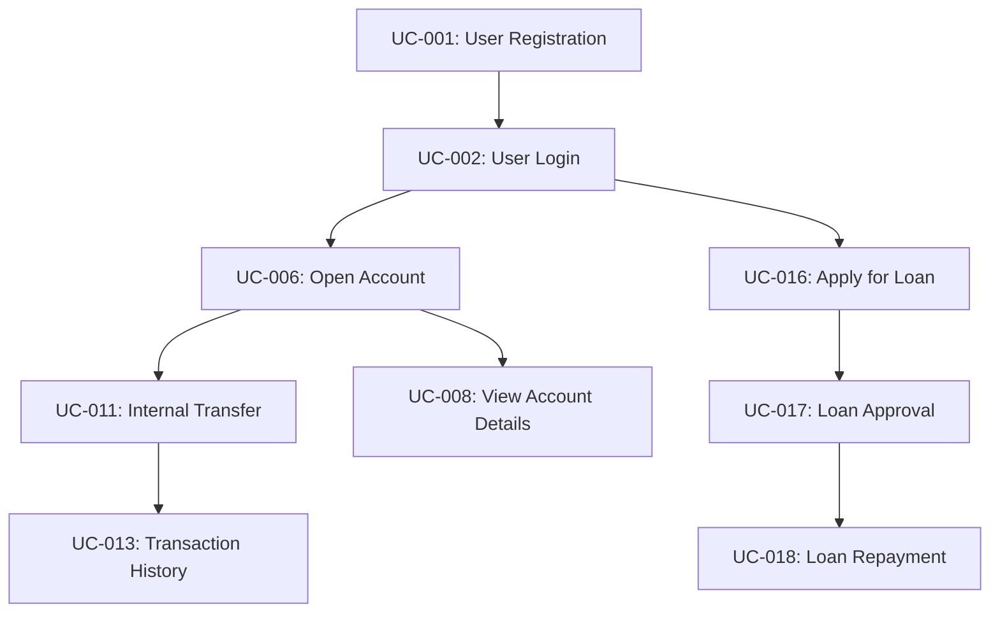
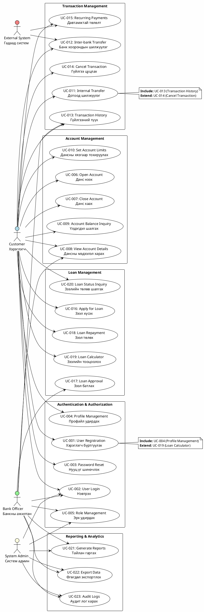
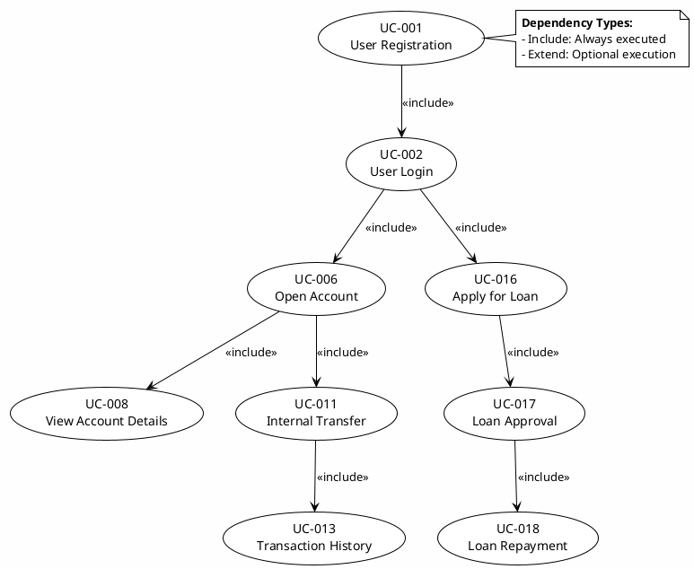
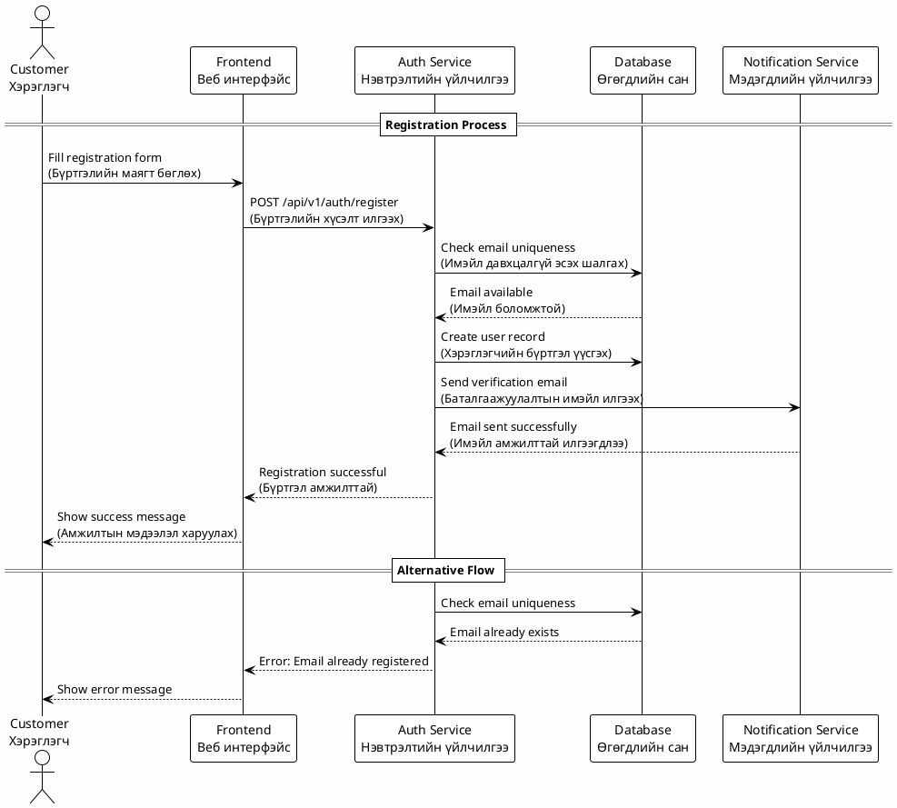
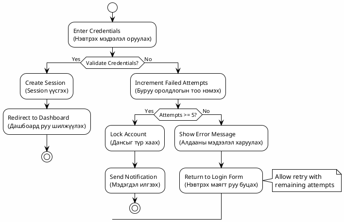
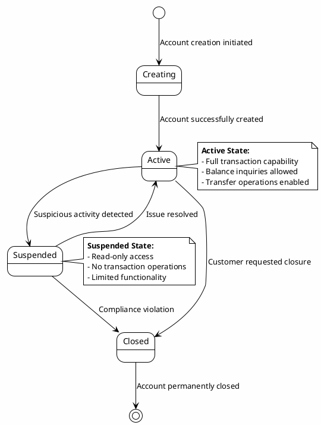
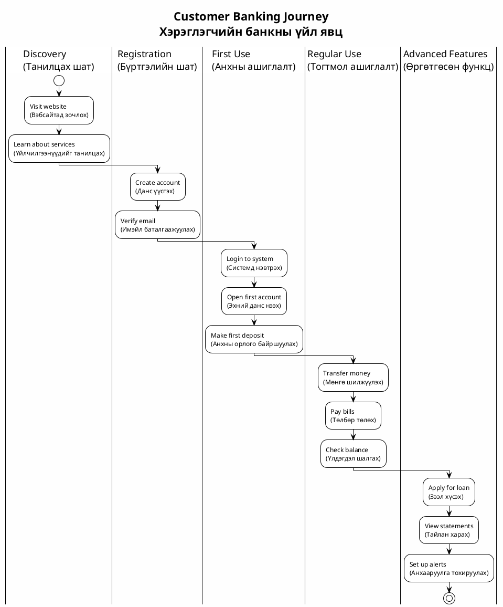
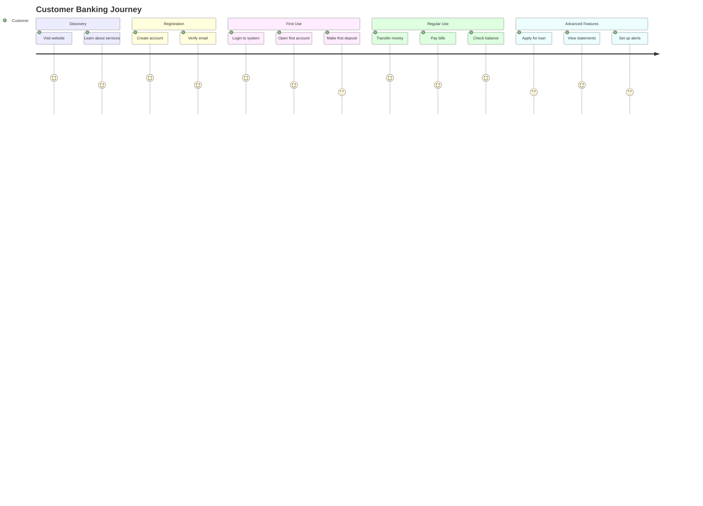
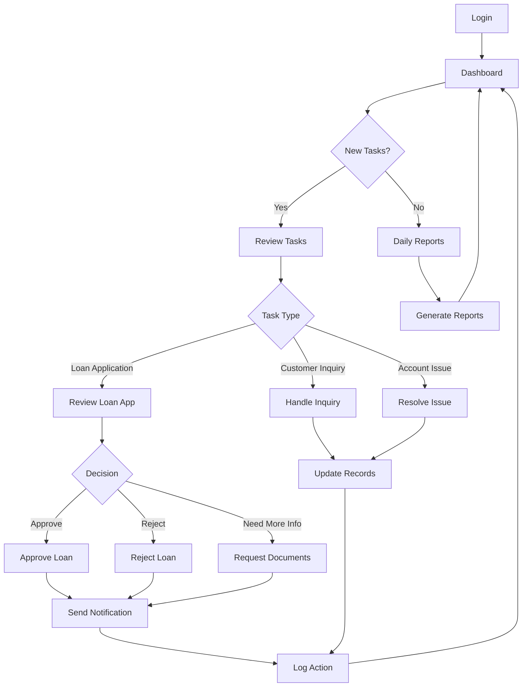

# СИСТЕМИЙН ШААРДЛАГА БАРИМТ БИЧИГ
## Голомт Банкны Интернэт Банкинг Систем

### Хувилбар: 1.0
### Огноо: 2024 оны 12 сар
### Зохиогч: Системийн шинжээч

---

## 1. СИСТЕМИЙН ЕРӨНХИЙ ТОДОРХОЙЛОЛТ

### 1.1 Системийн зорилго ба хамрах хүрээ

Голомт Банкны Интернэт Банкинг Систем нь банкуудын үйлчлүүлэгчдэд дараах үйлчилгээнүүдийг цахим хэлбэрээр үзүүлэх зорилготой:

- Дансны удирдах, хянах
- Гүйлгээ хийх, түүхийг хянах
- Зээл авах, төлөх
- Дотоод болон банкууд хоорондын шилжүүлэг
- Хэрэглэгчийн профайл удирдах

### 1.2 Системийн архитектур

Систем нь **микросервис архитектур**-ыг ашиглан бүтээгдсэн бөгөөд дараах үндсэн үйлчилгээнүүдээс бүрдэнэ:

- **Auth Service**: Хэрэглэгчийн нэвтрэлт, баталгаажуулалт
- **Account Service**: Дансны удирдах үйлчилгээ
- **Transaction Service**: Гүйлгээний үйлчилгээ
- **Loan Service**: Зээлийн үйлчилгээ
- **Cloud Gateway**: API Gateway, үйлчилгээнүүдийн чиглүүлэлт
- **Eureka**: Сервис discovery
- **Internet Bank**: Веб интерфэйс (React/Next.js)

---

## 2. ФУНКЦИОНАЛЬ ШААРДЛАГА

### 2.1 Auth Service (Нэвтрэлтийн үйлчилгээ)

#### Хэрэглэгчийн удирдах
- **SRS-AUTH-001**: Хэрэглэгч бүртгүүлэх
  - Шаардлагатай талбарууд: нэр, имэйл, утас, нууц үг
  - Имэйл баталгаажуулалт
  - Нууц үгийн хүчин чадлын шалгалт

- **SRS-AUTH-002**: Хэрэглэгч нэвтрэх
  - Имэйл/нууц үгээр нэвтрэлт
  - JWT токен үүсгэх
  - Олон төхөөрөмж дэмжих

- **SRS-AUTH-003**: Нууц үг шинэчлэх
  - Хуучин нууц үг шалгах
  - Нууц үгийн хүчин чадлын бодлого

- **SRS-AUTH-004**: Хэрэглэгчийн профайл удирдах
  - Хувийн мэдээлэл шинэчлэх
  - Аюулгүй байдлын тохиргоо

#### Аюулгүй байдал
- **SRS-AUTH-005**: Хандах эрх удирдах
  - Role-based access control (RBAC)
  - API endpoint-үүдийн хамгаалалт
  - Токен хүчинтэй байх хугацаа

- **SRS-AUTH-006**: Аюулгүй байдлын хяналт
  - Rate limiting
  - Brute force attack хамгаалалт
  - Аудит лог

### 2.2 Account Service (Дансны үйлчилгээ)

#### Дансны удирдах
- **SRS-ACCT-001**: Данс нээх
  - Дансны дугаар үүсгэх (автоматаар)
  - Анхны үлдэгдэл тохируулах
  - Дансны төрөл сонгох

- **SRS-ACCT-002**: Данс хаах
  - Үлдэгдэл шалгах (0 байх ёстой)
  - Дансны төлөв өөрчлөх
  - Аудит бүртгэл

- **SRS-ACCT-003**: Дансны мэдээлэл харах
  - Үлдэгдэл, түүх харах
  - Дансны дэлгэрэнгүй мэдээлэл
  - Гүйлгээний түүх

#### Дансны үйлдлүүд
- **SRS-ACCT-004**: Дансны үлдэгдэл шалгах
  - Real-time мэдээлэл
  - Cache ашиглах
  - Currency conversion

- **SRS-ACCT-005**: Дансны хязгаар тохируулах
  - Өдрийн лимит
  - Гүйлгээний лимит
  - Аюулгүй байдлын тохиргоо

### 2.3 Transaction Service (Гүйлгээний үйлчилгээ)

#### Гүйлгээний төрлүүд
- **SRS-TXN-001**: Дотоод шилжүүлэг
  - Данс хооронд шилжүүлэх
  - Real-time боловсруулалт
  - Хураамж тооцоолох

- **SRS-TXN-002**: Банк хоорондын шилжүүлэг
  - Бусад банк руу шилжүүлэх
  - SWIFT код ашиглах
  - Хугацаа шаардах боловсруулалт

- **SRS-TXN-003**: Автомат төлөлт
  - Давтамжтай төлөлт
  - Төлөвлөгөөт төлөлт
  - Төлөлтийн түүх

#### Гүйлгээний хяналт
- **SRS-TXN-004**: Гүйлгээний түүх харах
  - Шүүлтүүрээр хайх
  - Экспортлох боломж
  - PDF тайлан

- **SRS-TXN-005**: Гүйлгээ цуцлах
  - Зөвхөн тодорхой хугацаанд
  - Баталгаажуулалт шаардах
  - Аудит бүртгэл

### 2.4 Loan Service (Зээлийн үйлчилгээ)

#### Зээлийн үйл явц
- **SRS-LOAN-001**: Зээл хүсэх
  - Зээлийн хэлбэр сонгох
  - Хүсэх дүн, хугацаа
  - Орлогын баталгаа

- **SRS-LOAN-002**: Зээл батлах
  - Автомат болон гар баталгаажуулалт
  - Risk assessment
  - Баталгаажуулалтын урсгал

- **SRS-LOAN-003**: Зээл төлөх
  - Сар бүр төлөх
  - Эрт төлөх боломж
  - Торгууль тооцоолох

#### Зээлийн тооцоолол
- **SRS-LOAN-004**: Зээлийн хүү тооцоолох
  - Fixed vs variable rate
  - Сарын төлөлт бодох
  - Нийт төлөх дүн

- **SRS-LOAN-005**: Зээлийн хугацаа сунгах
  - Нөхцөл шалгах
  - Шинэ тооцоолол
  - Гэрээ шинэчлэх

### 2.5 Internet Bank (Веб интерфэйс)

#### Хэрэглэгчийн интерфэйс
- **SRS-UI-001**: Dashboard
  - Дансны үлдэгдэл харах
  - Сүүлийн гүйлгээнүүд
  - Зээлийн мэдээлэл

- **SRS-UI-002**: Responsive дизайн
  - Desktop, tablet, mobile дэмжих
  - Modern UI/UX
  - Accessibility стандартууд

#### Навигац
- **SRS-UI-003**: Меню систем
  - Данс, гүйлгээ, зээл
  - Хайлтын функц
  - Notification систем

---

## 3. БҮС ФУНКЦИОНАЛЬ ШААРДЛАГА

### 3.1 Гүйцэтгэлийн шаардлага

#### Хурд ба хугацаа
- **SRS-PERF-001**: API response time
  - GET хүсэлт: ≤ 200ms
  - POST/PUT хүсэлт: ≤ 500ms
  - Database query: ≤ 100ms

- **SRS-PERF-002**: Concurrent users
  - Зэрэг 1000 хэрэглэгч дэмжих
  - Peak load: 5000 concurrent users
  - Auto-scaling

#### Availability
- **SRS-PERF-003**: System uptime
  - 99.9% availability (8.76 hours downtime/year)
  - Maintenance windows: 2 AM - 4 AM
  - Disaster recovery: 4 hours RTO

### 3.2 Аюулгүй байдлын шаардлага

#### Authentication & Authorization
- **SRS-SEC-001**: JWT токен
  - Access token: 15 минут
  - Refresh token: 24 цаг
  - Secure storage

- **SRS-SEC-002**: Multi-factor authentication
  - SMS OTP
  - Email verification
  - Biometric authentication

#### Data Protection
- **SRS-SEC-003**: Data encryption
  - Database: AES-256 encryption
  - Transmission: TLS 1.3
  - Sensitive data masking

- **SRS-SEC-004**: Compliance
  - GDPR compliance
  - PCI DSS for payments
  - Local banking regulations

### 3.3 Скалабилити шаардлага

#### Horizontal Scaling
- **SRS-SCALE-001**: Microservice scaling
  - Auto-scaling based on CPU/memory
  - Load balancer configuration
  - Database read replicas

#### Data Management
- **SRS-SCALE-002**: Database optimization
  - Indexing strategy
  - Query optimization
  - Connection pooling

### 3.4 Интеграцийн шаардлага

#### External Systems
- **SRS-INT-001**: Bank API integration
  - Core banking system
  - Payment gateways
  - Credit scoring systems

#### Internal Communication
- **SRS-INT-002**: Service mesh
  - Service discovery
  - Circuit breaker pattern
  - Distributed tracing

---

## 4. ТЕХНИКИЙН ШААРДЛАГА

### 4.1 Технологийн стек

#### Backend
- **Framework**: Spring Boot 3.x
- **Language**: Java 17+
- **Database**: PostgreSQL 15+
- **Cache**: Redis 7.x
- **Message Queue**: Apache Kafka/RabbitMQ

#### Frontend
- **Framework**: Next.js 15.x
- **Language**: TypeScript 5.x
- **UI Library**: Material-UI, Tailwind CSS
- **State Management**: Redux Toolkit

#### Infrastructure
- **Container**: Docker 24+
- **Orchestration**: Kubernetes 1.28+
- **API Gateway**: Spring Cloud Gateway
- **Service Discovery**: Netflix Eureka

### 4.2 Системийн архитектур

#### Microservices Architecture
```
┌─────────────────┐    ┌─────────────────┐
│   Internet Bank │    │   Cloud Gateway │
│   (React/Next)  │────│   (API Gateway) │
└─────────────────┘    └─────────────────┘
                              │
                    ┌─────────┼─────────┐
                    │         │         │
           ┌────────▼──┐ ┌────▼───┐ ┌───▼────┐
           │Auth Service│ │Account │ │Transaction
           │            │ │Service │ │Service │
           └────────────┘ └────────┘ └────────┘
                    │         │         │
           ┌────────▼──┐ ┌────▼───┐     │
           │Loan Service│ │  Eureka│     │
           │            │ │Discovery│     │
           └────────────┘ └────────┘     │
                              ┌─────────┼─────────┐
                              │         │         │
                       ┌──────▼───┐ ┌───▼────┐ ┌──▼────┐
                       │PostgreSQL│ │ Redis  │ │Kafka  │
                       │          │ │        │ │       │
                       └──────────┘ └────────┘ └───────┘
```

### 4.3 API Design

#### RESTful API Standards
- HTTP methods: GET, POST, PUT, DELETE
- Response format: JSON
- Error handling: Standardized error codes
- Pagination: Cursor-based pagination
- Versioning: URL versioning (v1, v2)

#### API Endpoints Examples

**Authentication Service:**
```
POST /api/v1/auth/login
POST /api/v1/auth/register
POST /api/v1/auth/refresh
GET  /api/v1/auth/profile
```

**Account Service:**
```
GET    /api/v1/accounts
POST   /api/v1/accounts
GET    /api/v1/accounts/{id}
PUT    /api/v1/accounts/{id}
DELETE /api/v1/accounts/{id}/close
```

**Transaction Service:**
```
GET    /api/v1/transactions
POST   /api/v1/transactions/transfer
GET    /api/v1/transactions/{id}
POST   /api/v1/transactions/{id}/cancel
```

### 4.4 Database Schema

#### Core Tables
- **users**: Хэрэглэгчийн мэдээлэл
- **accounts**: Дансны мэдээлэл
- **transactions**: Гүйлгээний түүх
- **loans**: Зээлийн мэдээлэл
- **audit_logs**: Аудит лог

#### Database Design Principles
- Normalized schema
- Foreign key constraints
- Indexing strategy
- Partitioning for large tables

---

## 5. ХЭРЭГЛЭГЧИЙН РОЛЬ БА ЗӨВШӨӨРӨЛ

### 5.1 Хэрэглэгчийн төрлүүд

#### 1. Энгийн хэрэглэгч (Customer)
- Данс үүсгэх, хаах
- Гүйлгээ хийх
- Зээл хүсэх
- Профайл удирдах

#### 2. Банкны ажилтан (Bank Staff)
- Хэрэглэгчийн данс хянах
- Гүйлгээ батлах
- Зээл батлах
- Тайлан үзэх

#### 3. Администратор (Administrator)
- Систем удирдах
- Хандах эрх тохируулах
- Системийн тохиргоо
- Аудит хянах

### 5.2 Зөвшөөрлийн матриц

| Функц | Энгийн хэрэглэгч | Банкны ажилтан | Администратор |
|-------|------------------|----------------|----------------|
| Данс үзэх | ✓ | ✓ | ✓ |
| Гүйлгээ хийх | ✓ | ✗ | ✗ |
| Зээл батлах | ✗ | ✓ | ✓ |
| Хэрэглэгч удирдах | ✗ | ✗ | ✓ |
| Систем тохиргоо | ✗ | ✗ | ✓ |

---

## 6. ТЕСТИЙН ШААРДЛАГА

### 6.1 Unit Testing
- Code coverage: 80% minimum
- Business logic testing
- Error handling testing
- Mock external dependencies

### 6.2 Integration Testing
- API endpoint testing
- Database integration testing
- Microservice communication testing
- End-to-end workflow testing

### 6.3 Performance Testing
- Load testing: 1000 concurrent users
- Stress testing: System limits
- Endurance testing: 24-hour continuous load

### 6.4 Security Testing
- Penetration testing
- Vulnerability scanning
- Security code review
- Compliance auditing

---

## 7. ХЭВИЙН БАЙДЛЫН ТӨЛӨВЛӨЛТ

### 7.1 Хөгжүүлэлтийн шат
1. **Phase 1**: Core services (Auth, Account) - 3 сар
2. **Phase 2**: Transaction service - 2 сар
3. **Phase 3**: Loan service - 2 сар
4. **Phase 4**: Frontend development - 3 сар
5. **Phase 5**: Testing & deployment - 2 сар

### 7.2 Хүний нөөц
- **Backend Developer**: 4 хүн
- **Frontend Developer**: 2 хүн
- **DevOps Engineer**: 1 хүн
- **QA Engineer**: 2 хүн
- **Business Analyst**: 1 хүн
- **Project Manager**: 1 хүн

### 7.3 Бюджет
- **Хөгжүүлэлт**: 150,000,000₮
- **Инфраструктур**: 50,000,000₮
- **Тест хийх**: 30,000,000₮
- **Сургалт**: 10,000,000₮
- **Нийт**: 240,000,000₮

---

## 8. РИСК БА ТӨЛӨВЛӨЛТ

### 8.1 Техник риск
- **Технологийн өөрчлөлт**: Framework шинэчлэлт
- **Performance issues**: High load handling
- **Security vulnerabilities**: Regular security audits
- **Integration complexity**: External system compatibility

### 8.2 Бизнес риск
- **Regulatory compliance**: Banking regulations changes
- **Market competition**: New fintech solutions
- **User adoption**: User experience optimization
- **Operational costs**: Infrastructure scaling costs

### 8.3 Риск бууруулах стратеги
- Regular code reviews and testing
- Continuous integration/deployment
- Security monitoring and auditing
- Performance monitoring and optimization
- Regular backup and disaster recovery testing

---

## 10. USE CASE ДИАГРАМ БА ДЭЛГЭРЭНГҮЙ ШИНЖИЛГЭЭ

### 10.1 Ерөнхий Use Case Диаграм

```mermaid
graph TD
    subgraph "Actors"
        CU[Customer<br/>Хэрэглэгч]
        BO[Bank Officer<br/>Банкны ажилтан]
        SA[System Admin<br/>Систем админ]
        ES[External System<br/>Гадаад систем]
    end

    subgraph "Authentication & Authorization"
        UC1[User Registration<br/>Хэрэглэгч бүртгүүлэх]
        UC2[User Login<br/>Нэвтрэх]
        UC3[Password Reset<br/>Нууц үг шинэчлэх]
        UC4[Profile Management<br/>Профайл удирдах]
        UC5[Role Management<br/>Эрх удирдах]
    end

    subgraph "Account Management"
        UC6[Open Account<br/>Данс нээх]
        UC7[Close Account<br/>Данс хаах]
        UC8[View Account Details<br/>Дансны мэдээлэл харах]
        UC9[Account Balance Inquiry<br/>Үлдэгдэл шалгах]
        UC10[Set Account Limits<br/>Дансны хязгаар тохируулах]
    end

    subgraph "Transaction Management"
        UC11[Internal Transfer<br/>Дотоод шилжүүлэг]
        UC12[Inter-bank Transfer<br/>Банк хоорондын шилжүүлэг]
        UC13[Transaction History<br/>Гүйлгээний түүх]
        UC14[Cancel Transaction<br/>Гүйлгээ цуцлах]
        UC15[Recurring Payments<br/>Давтамжтай төлөлт]
    end

    subgraph "Loan Management"
        UC16[Apply for Loan<br/>Зээл хүсэх]
        UC17[Loan Approval<br/>Зээл батлах]
        UC18[Loan Repayment<br/>Зээл төлөх]
        UC19[Loan Calculator<br/>Зээлийн тооцоолох]
        UC20[Loan Status Inquiry<br/>Зээлийн төлөв шалгах]
    end

    subgraph "Reporting & Analytics"
        UC21[Generate Reports<br/>Тайлан гаргах]
        UC22[Export Data<br/>Өгөгдөл экспортлох]
        UC23[Audit Logs<br/>Аудит лог харах]
    end

    CU --> UC1
    CU --> UC2
    CU --> UC3
    CU --> UC4
    CU --> UC6
    CU --> UC7
    CU --> UC8
    CU --> UC9
    CU --> UC10
    CU --> UC11
    CU --> UC12
    CU --> UC13
    CU --> UC14
    CU --> UC15
    CU --> UC16
    CU --> UC18
    CU --> UC19
    CU --> UC20

    BO --> UC2
    BO --> UC5
    BO --> UC8
    BO --> UC13
    BO --> UC17
    BO --> UC21
    BO --> UC22
    BO --> UC23

    SA --> UC2
    SA --> UC5
    SA --> UC21
    SA --> UC22
    SA --> UC23

    ES --> UC12
    ES --> UC15
```



### 10.2 Actor Definitions

#### Primary Actors
1. **Customer (Хэрэглэгч)**
   - **Description**: Голомт Банкны үйлчлүүлэгч
   - **Goals**: Данс удирдах, гүйлгээ хийх, зээл авах
   - **Characteristics**: Имэйл, утас, банкны данс

2. **Bank Officer (Банкны ажилтан)**
   - **Description**: Банкны үйлчилгээний ажилтан
   - **Goals**: Хэрэглэгчийн хүсэлтүүдийг боловсруулах, тайлан гаргах
   - **Characteristics**: Банкны ажилтны эрх, хандах боломж

3. **System Administrator (Систем админ)**
   - **Description**: Системийн удирдагч
   - **Goals**: Системийн тохиргоо, хандах эрх удирдах
   - **Characteristics**: Бүрэн хандах эрх

4. **External System (Гадаад систем)**
   - **Description**: Бусад банк, төлбөрийн систем
   - **Goals**: Банк хоорондын гүйлгээ
   - **Characteristics**: API integration

### 10.3 Дэлгэрэнгүй Use Case Specifications

#### UC-001: User Registration (Хэрэглэгч бүртгүүлэх)

**Actor**: Customer

**Preconditions**:
- Хэрэглэгч системд бүртгэгдээгүй байх
- Имэйл хаяг хүчинтэй байх

**Main Success Scenario**:
1. Хэрэглэгч бүртгэлийн маягтыг нээнэ
2. Шаардлагатай мэдээллээ оруулна (нэр, имэйл, утас, нууц үг)
3. Нууц үгийн хүчин чадлыг шалгана
4. Имэйл баталгаажуулалтын код илгээнэ
5. Хэрэглэгч кодыг оруулж баталгаажуулна
6. Бүртгэл амжилттай болж, нэвтрэх боломжтой болно

**Alternative Flows**:
- A1: Имэйл аль хэдийн бүртгэгдсэн
  - Систем алдааны мэдээлэл харуулна
  - Нэвтрэх хуудас руу чиглүүлнэ

- A2: Нууц үг хүчин чадал муу
  - Шаардлагыг харуулж, дахин оруулахыг хүснэ

**Postconditions**:
- Хэрэглэгчийн профайл үүснэ
- Имэйл баталгаажсан төлөвтэй болно
- Аудит лог бүртгэгдэнэ

#### UC-002: User Login (Нэвтрэх)

**Actor**: Customer, Bank Officer, System Admin

**Preconditions**:
- Хэрэглэгч бүртгэгдсэн байх
- Имэйл баталгаажсан байх

**Main Success Scenario**:
1. Хэрэглэгч нэвтрэх маягтыг нээнэ
2. Имэйл ба нууц үгээ оруулна
3. Систем мэдээллийг шалгана
4. JWT токен үүсгэнэ
5. Dashboard руу чиглүүлнэ

**Alternative Flows**:
- A1: Буруу имэйл/нууц үг
  - Алдааны мэдээлэл харуулна
  - Дахин оролдох боломж өгнө

- A2: Account locked
  - Түр хаагдсан мэдээлэл харуулна
  - Сэргээх заавар өгнө

**Postconditions**:
- Хэрэглэгч нэвтэрсэн төлөвтэй болно
- Session үүснэ
- Аудит лог бүртгэгдэнэ

#### UC-006: Open Account (Данс нээх)

**Actor**: Customer

**Preconditions**:
- Хэрэглэгч нэвтэрсэн байх
- Хэрэглэгчийн мэдээлэл бүрэн байх

**Main Success Scenario**:
1. Хэрэглэгч "Данс нээх" цэсийг сонгоно
2. Дансны төрөл сонгоно (хадгаламж, харилцах, валютын)
3. Анхны мэдээллээ оруулна
4. Систем дансны дугаар үүсгэнэ
5. Данс нээгдсэн мэдээлэл харуулна

**Alternative Flows**:
- A1: Дансны лимит хэтэрсэн
  - Алдааны мэдээлэл харуулна
  - Дансны тоо хязгаарлах бодлого харуулна

**Postconditions**:
- Шинэ данс үүснэ
- Дансны дугаар үүсэгдэнэ
- Аудит лог бүртгэгдэнэ

#### UC-011: Internal Transfer (Дотоод шилжүүлэг)

**Actor**: Customer

**Preconditions**:
- Хэрэглэгч нэвтэрсэн байх
- Хоёр ба түүнээс дээш данс байх
- Хүлээн авагч данс хүчинтэй байх

**Main Success Scenario**:
1. Хэрэглэгч шилжүүлгийн маягтыг нээнэ
2. Илгээх данс, хүлээн авах данс сонгоно
3. Шилжүүлэх дүнг оруулна
4. Гүйлгээний утгыг оруулна
5. Баталгаажуулалт шаардана
6. Гүйлгээ амжилттай болно

**Alternative Flows**:
- A1: Үлдэгдэл хүрэлцэхгүй
  - Алдааны мэдээлэл харуулна
  - Боломжтой үлдэгдэл харуулна

- A2: Хүлээн авагч данс олдсонгүй
  - Алдааны мэдээлэл харуулна
  - Дахин шалгахыг хүснэ

**Postconditions**:
- Гүйлгээ бүртгэгдэнэ
- Үлдэгдэл шинэчлэгдэнэ
- Гүйлгээний түүх шинэчлэгдэнэ

#### UC-016: Apply for Loan (Зээл хүсэх)

**Actor**: Customer

**Preconditions**:
- Хэрэглэгч нэвтэрсэн байх
- Хэрэглэгчийн мэдээлэл бүрэн байх
- Credit score шалгасан байх

**Main Success Scenario**:
1. Хэрэглэгч зээлийн маягтыг нээнэ
2. Зээлийн төрөл сонгоно
3. Хүсэх дүн, хугацаа оруулна
4. Орлогын мэдээлэл оруулна
5. Хүсэлт илгээнэ
6. Хүлээн авсан мэдээлэл харуулна

**Alternative Flows**:
- A1: Credit score муу
  - Татгалзсан мэдээлэл харуулна
  - Шалтгааны тайлбар өгнө

**Postconditions**:
- Зээлийн хүсэлт үүснэ
- Банкны ажилтанд мэдэгдэнэ
- Аудит лог бүртгэгдэнэ

#### UC-017: Loan Approval (Зээл батлах)

**Actor**: Bank Officer

**Preconditions**:
- Зээлийн хүсэлт ирсэн байх
- Bank Officer нэвтэрсэн байх

**Main Success Scenario**:
1. Bank Officer хүсэлтийг нээнэ
2. Хэрэглэгчийн мэдээллийг шалгана
3. Risk assessment хийнэ
4. Батлах/татгалзах шийдвэр гаргана
5. Хэрэглэгчид мэдэгдэнэ

**Alternative Flows**:
- A1: Нэмэлт мэдээлэл шаардлагатай
  - Хэрэглэгчээс нэмэлт мэдээлэл хүснэ

**Postconditions**:
- Зээлийн төлөв шинэчлэгдэнэ
- Хэрэглэгчид мэдэгдэл илгээгдэнэ
- Аудит лог бүртгэгдэнэ

### 10.4 Business Rules

#### Authentication Rules
- **BR-AUTH-001**: Нууц үг дор хаяж 8 тэмдэгт, том жижиг үсэг, тоо, тэмдэгт агуулсан байх
- **BR-AUTH-002**: Нэг имэйлээр зөвхөн нэг хэрэглэгч бүртгүүлэх боломжтой
- **BR-AUTH-003**: 5 удаа буруу нэвтрэхэд account түр хугацаагаар хаагдана

#### Account Rules
- **BR-ACCT-001**: Нэг хэрэглэгч 5 хүртэл данс нээх боломжтой
- **BR-ACCT-002**: Данс хаахдаа үлдэгдэл 0 байх ёстой
- **BR-ACCT-003**: Валютын дансны үлдэгдэл 1000₮-с багагүй байх

#### Transaction Rules
- **BR-TXN-001**: Нэг өдөр 10,000,000₮ хүртэл шилжүүлэх боломжтой
- **BR-TXN-002**: Гүйлгээ цуцлах боломж зөвхөн 24 цагийн дотор
- **BR-TXN-003**: Банк хоорондын гүйлгээ 1-3 хоногийн хугацаатай

#### Loan Rules
- **BR-LOAN-001**: Зээлийн хүү 1.5%-3.5% хооронд
- **BR-LOAN-002**: Зээлийн хугацаа 3-60 сар
- **BR-LOAN-003**: Зээлийн дүн орлогоос хамаарах

### 10.5 Use Case Priority Matrix

| Use Case | Priority | Complexity | Business Value |
|----------|----------|------------|----------------|
| UC-002 (Login) | High | Low | High |
| UC-011 (Internal Transfer) | High | Medium | High |
| UC-016 (Apply for Loan) | High | High | High |
| UC-006 (Open Account) | Medium | Medium | Medium |
| UC-017 (Loan Approval) | Medium | High | Medium |
| UC-021 (Generate Reports) | Low | Medium | Medium |

### 10.6 Use Case Dependencies



### 10.7 PlantUML Use Case Диаграм

#### Ерөнхий Use Case Диаграм (PlantUML)


#### Use Case Dependencies (PlantUML)


#### Sequence Diagram - User Registration (PlantUML)


#### Activity Diagram - Customer Login (PlantUML)


#### State Diagram - Account States (PlantUML)


#### Customer Journey Map (PlantUML)


### 10.8 Нэмэлт Use Case Диаграм

#### Customer Journey Map


#### Bank Officer Workflow


---

## 9. ДЭД ХЭСЭГ

### 11.1 Ном зүй
1. "Building Microservices" - Sam Newman
2. "Clean Architecture" - Robert C. Martin
3. "Spring Boot in Action" - Craig Walls
4. "React: Up and Running" - Stoyan Stefanov
5. "UML Distilled" - Martin Fowler
6. "Use Case Modeling" - Kurt Bittner & Ian Spence

### 11.2 Холбоос
- Project repository: [GitHub Link]
- API Documentation: [Swagger/OpenAPI Link]
- Design mockups: [Figma Link]
- Project management: [Jira/Trello Link]
- Use Case Diagrams: [Lucidchart/Miro Link]
- UML Diagrams Guide: [README-UML-DIAGRAMS.md](README-UML-DIAGRAMS.md)
- PlantUML Online Editor: [https://www.plantuml.com/plantuml](https://www.plantuml.com/plantuml)

### 11.3 Хавсралт
- A: Detailed API specifications
- B: Database schema diagrams
- C: User interface mockups
- D: Test cases and scenarios
- E: Deployment architecture diagrams
- F: Use case specifications (detailed)
- G: Sequence diagrams
- H: Activity diagrams
- I: State diagrams
- J: Business rules catalog

### 11.4 PlantUML Диаграм файлууд
- **use-case-diagram.puml**: Ерөнхий use case диаграм
- **use-case-dependencies.puml**: Use case-үүдийн хамаарлууд
- **user-registration-sequence.puml**: Хэрэглэгч бүртгүүлэх үйл явц
- **customer-login-activity.puml**: Хэрэглэгч нэвтрэх үйл явц
- **account-states.puml**: Дансны төлөв диаграм
- **customer-journey-map.puml**: Хэрэглэгчийн үйл явц
- **loan-approval-sequence.puml**: Зээлийн баталгаажуулалтын үйл явц

**PlantUML файлуудыг ашиглах заавар:**
1. PlantUML plugin суулгасан IDE ашиглана (VS Code, IntelliJ)
2. PlantUML server ашиглан preview харах: `https://www.plantuml.com/plantuml`
3. PDF/ PNG экспортлох боломжтой

**Диаграмын legend:**
- 🔵 Actor (Цэнхэр): Customer, Bank Officer, System Admin
- 🟢 Actor (Ногоон): External System
- 🟡 Use Case (Шар): Authentication functions
- 🟠 Use Case (Улбар шар): Account Management
- 🔴 Use Case (Улаан): Transaction Management
- 🟣 Use Case (Нил ягаан): Loan Management
- 🟤 Use Case (Бор): Reporting functions

---

**Баталгаажуулсан:** _________________________
**Огноо:** _________________________
**Гарын үсэг:** _________________________

**Зөвшөөрсөн:** _________________________
**Огноо:** _________________________
**Гарын үсэг:** _________________________

