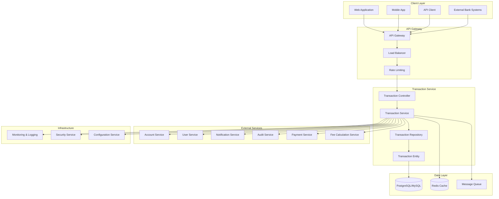
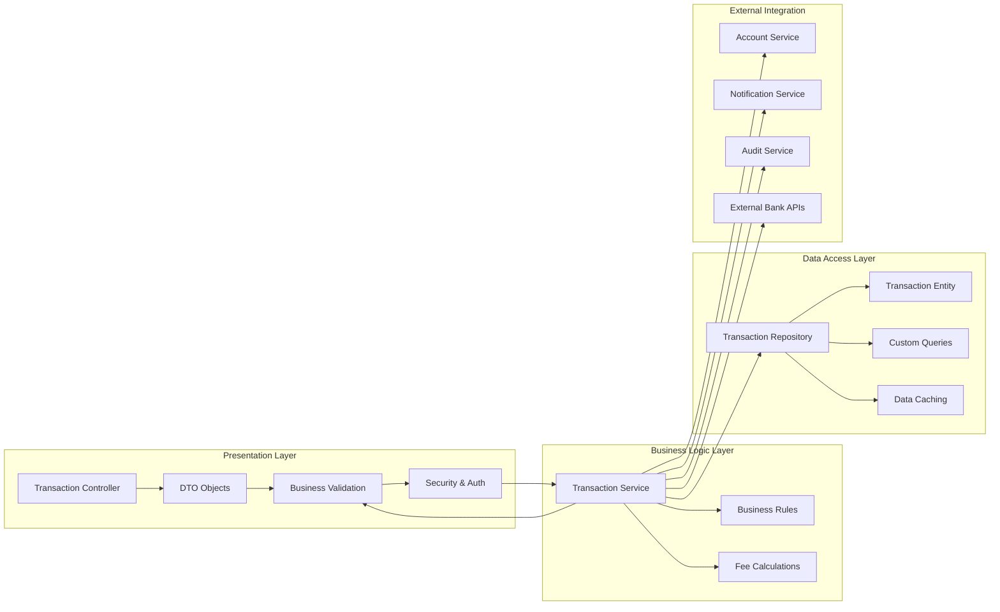
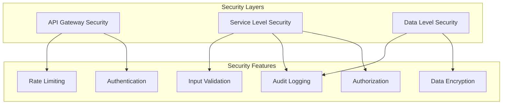
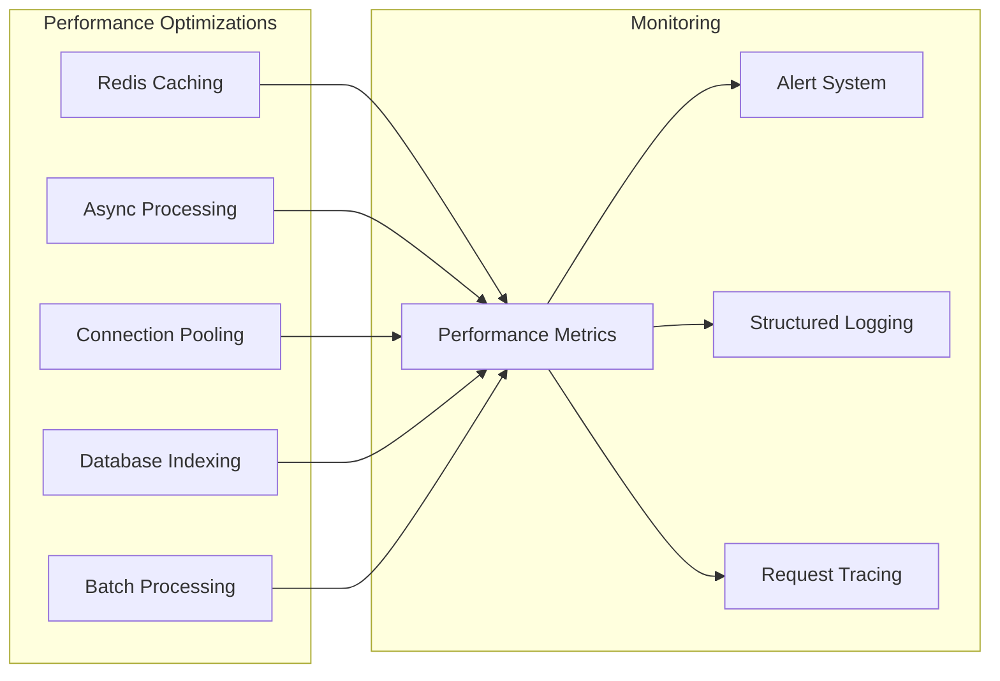
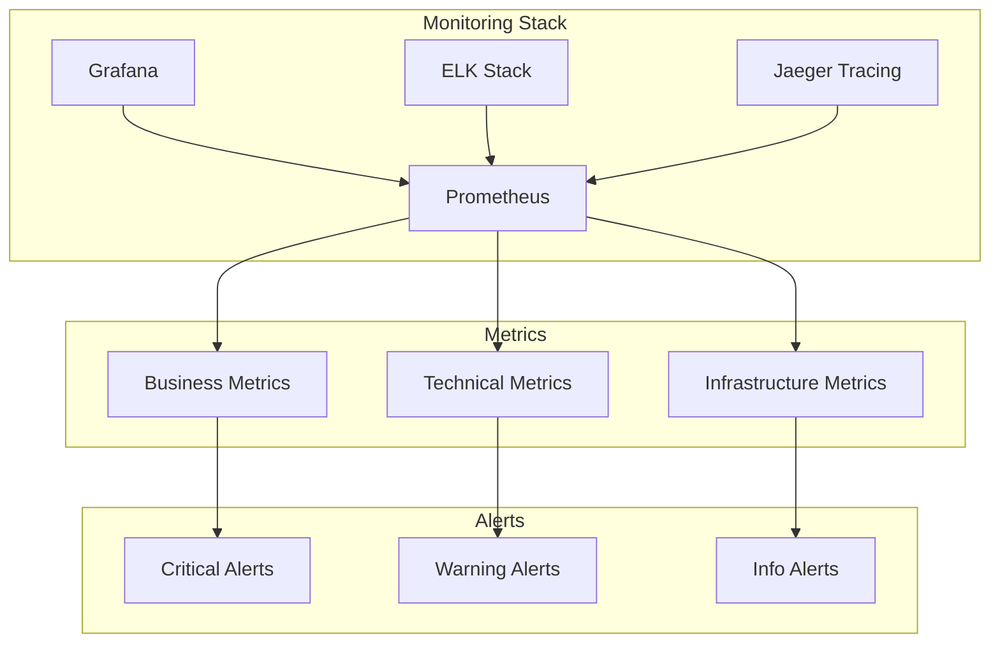
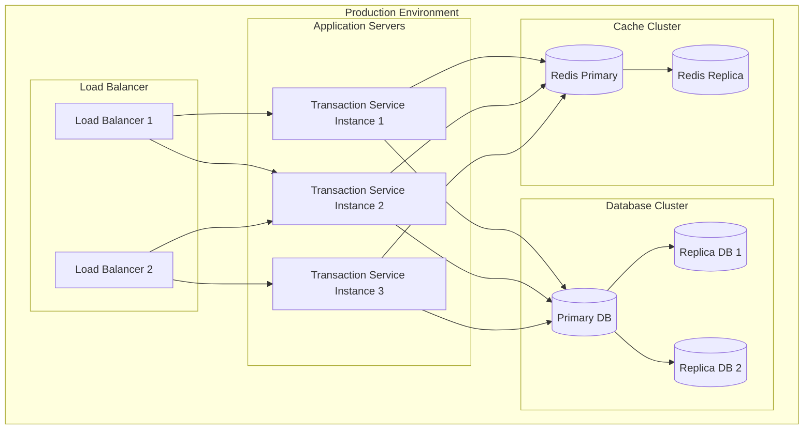
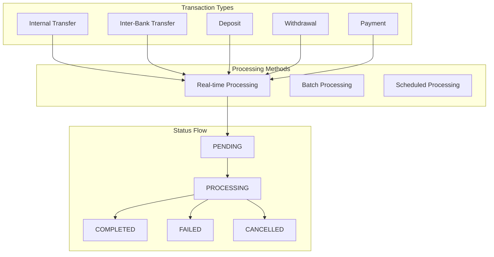
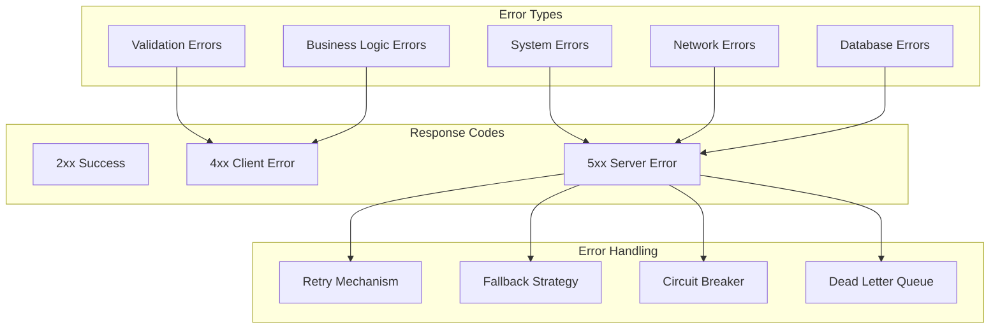

# Transaction Service - Гүйлгээний үйлчилгээ Architecture

Энэ файл нь Transaction Service-ийн системийн архитектурын ерөнхий харагдах байдлыг тайлбарлана.

## 1. Системийн архитектурын диаграм



## 2. Үйлчилгээний давхарга (Service Layers)



## 3. Бүрэлдэхүүн хэсгүүдийн хариуцлага

### Controller Layer
- **Хүсэлтийг хүлээн авах**: HTTP request-үүдийг хүлээн авах
- **Хүсэлтийг баталгаажуулах**: Request validation
- **Хариу буцаах**: Response formatting
- **Алдааны боловсруулалт**: Error handling
- **Security**: Authentication & authorization

### Service Layer
- **Бизнес логик**: Гүйлгээний дүрэм, тооцоолол
- **Хүсэлтийг боловсруулах**: Request processing
- **Гадаад үйлчилгээтэй холбогдох**: External service integration
- **Аудит**: Audit logging
- **Fee Calculation**: Гүйлгээний хураамж тооцоолох

### Data Access Layer
- **Өгөгдлийн хандалт**: Data access
- **CRUD үйлдлүүд**: Create, Read, Update, Delete
- **Хайлтын функцүүд**: Search functions
- **Өгөгдлийн баталгаажуулалт**: Data validation

## 4. Өгөгдлийн урсгал (Data Flow)

### 1. Гүйлгээний урсгал
```
Client → Controller → Service → Repository → Database
                ↓
            Validation → Business Logic → Persistence
```

### 2. Гүйлгээний мэдээлэл авах
```
Client → Controller → Service → Repository → Database
                ↓
            Authorization → Query → Response Mapping
```

### 3. Гүйлгээний боловсруулалт
```
Client → Controller → Service → External Services
                ↓
            Business Rules → Notifications → Status Update
```

## 5. Аюулгүй байдлын онцлогууд



## 6. Гүйцэтгэлийн хэмжээ (Performance Considerations)



## 7. Хяналт, мэдээлэл (Monitoring & Observability)



## 8. Суулгац, ашиглалт (Deployment Architecture)



## 9. Гүйлгээний төрлүүд (Transaction Types)



## 10. Алдааны боловсруулалт (Error Handling)



## Үндсэн онцлогууд

### Технологийн стек
- **Backend**: Spring Boot, Java
- **Database**: PostgreSQL/MySQL with JPA/Hibernate
- **Cache**: Redis
- **Message Queue**: Apache Kafka/RabbitMQ
- **Container**: Docker
- **Orchestration**: Kubernetes
- **Monitoring**: Prometheus, Grafana, ELK Stack

### Архитектурын зарчим
- **Microservices**: Тусдаа үйлчилгээ
- **Layered Architecture**: Давхаргатай архитектур
- **Separation of Concerns**: Хариуцлагын тусгаарлалт
- **SOLID Principles**: SOLID зарчим
- **Event-Driven**: Үйл явдалд суурилсан

### Аюулгүй байдал
- **JWT Authentication**: JWT токен
- **Role-Based Access**: Эрхэд суурилсан хандалт
- **Rate Limiting**: Хурдны хязгаарлалт
- **Audit Logging**: Аудит бүртгэл
- **Data Encryption**: Өгөгдлийн шифрлэлт

### Гүйлгээний онцлогууд
- **Real-time Processing**: Шуурхай боловсруулалт
- **Transaction Atomicity**: Гүйлгээний атом байдал
- **Rollback Support**: Буцаах боломж
- **Audit Trail**: Аудит мөр
- **Multi-currency**: Олон валютын дэмжлэг

### Гүйцэтгэлийн онцлогууд
- **Horizontal Scaling**: Хэвтээ өргөтгөл
- **Load Balancing**: Ачаал тэнцвэржүүлэлт
- **Caching Strategy**: Кэш стратеги
- **Async Processing**: Асинхрон боловсруулалт
- **Database Optimization**: Өгөгдлийн сангийн оновчлол
