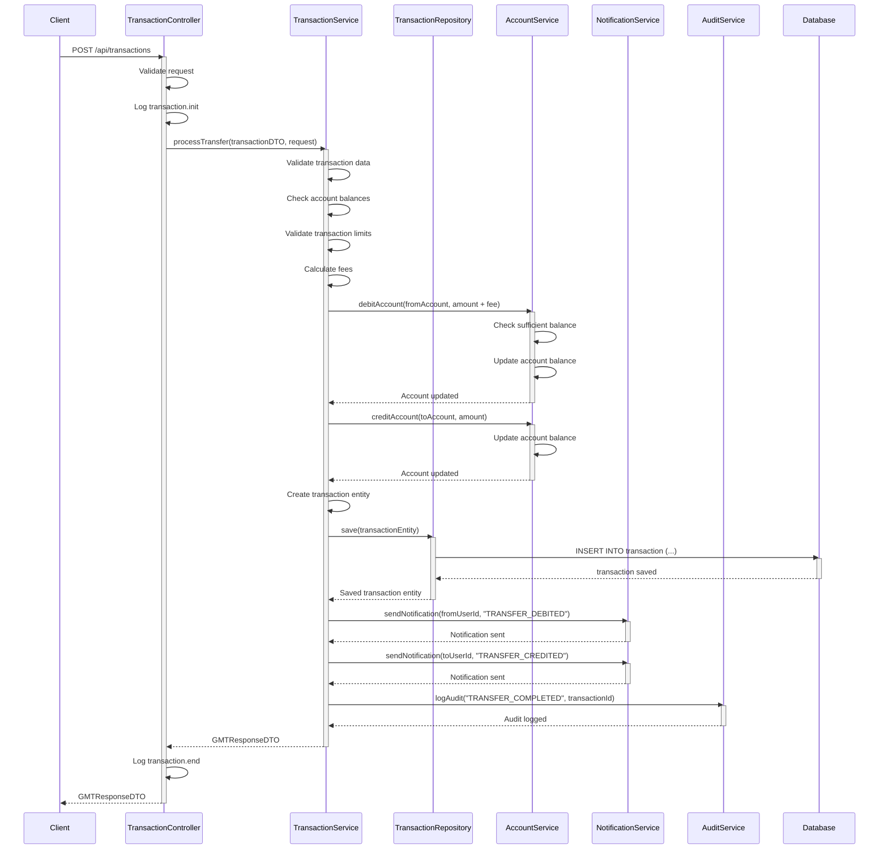
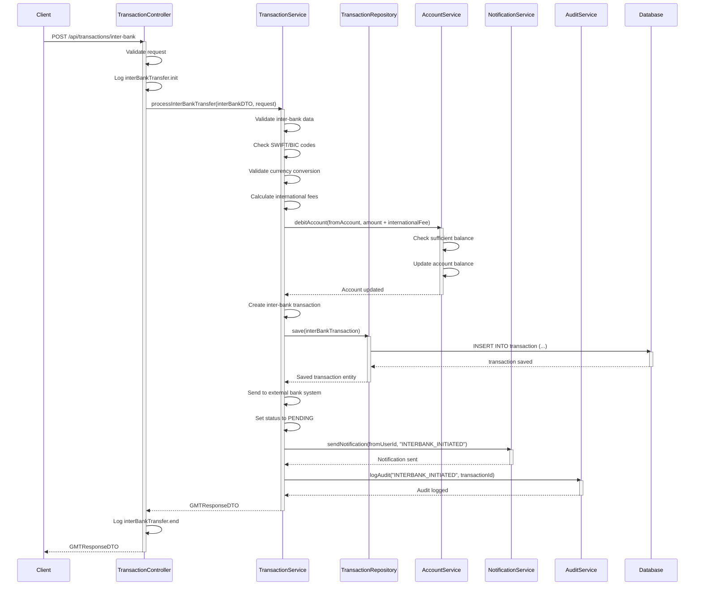
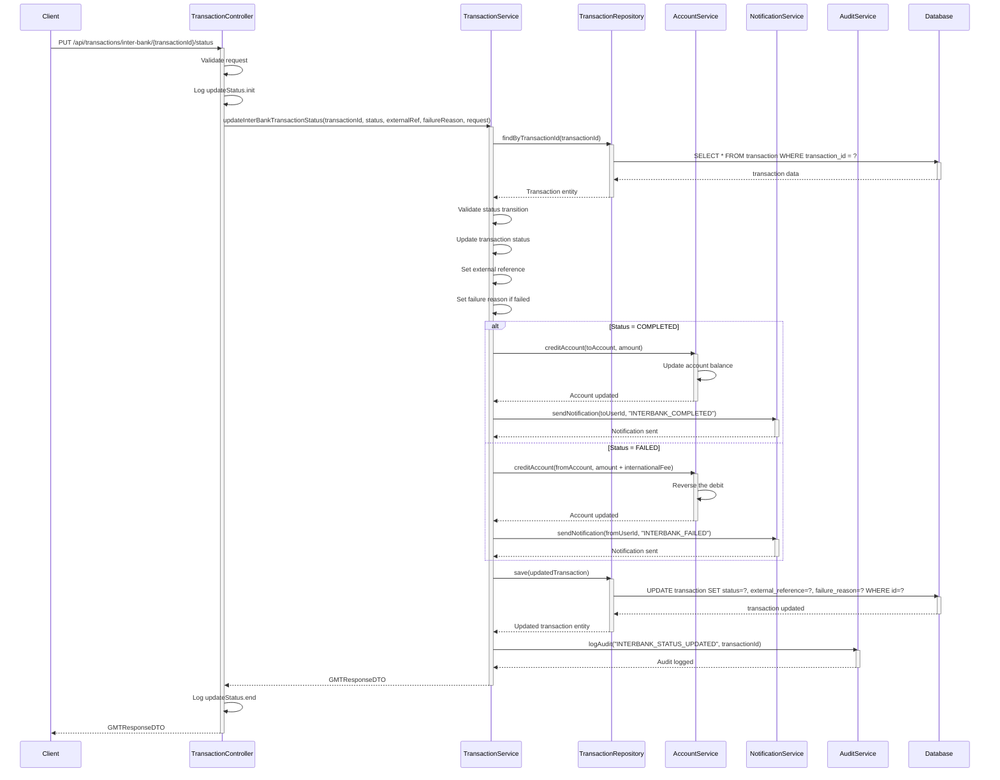
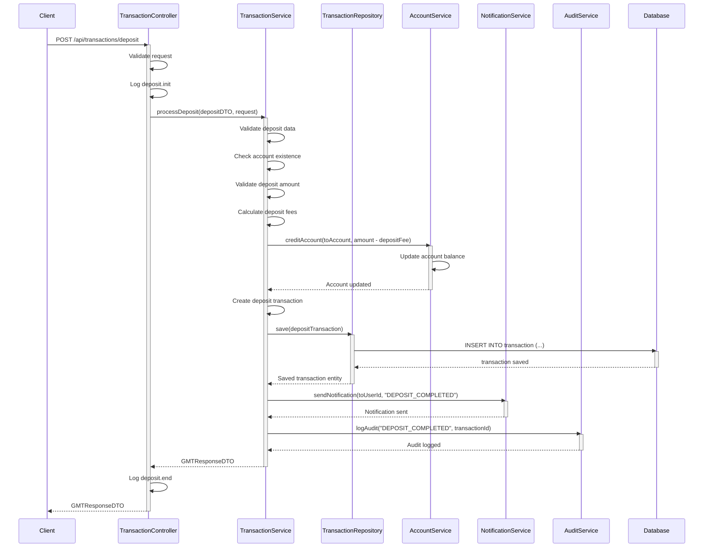
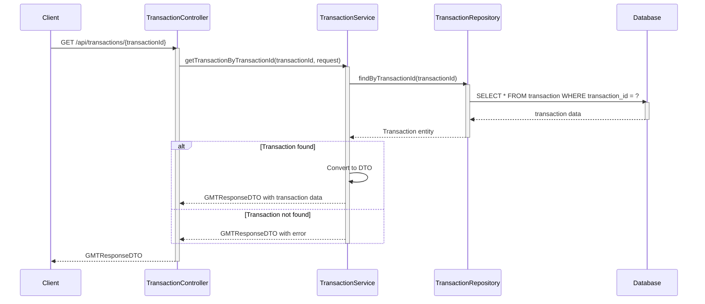
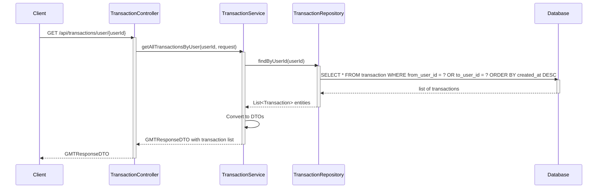
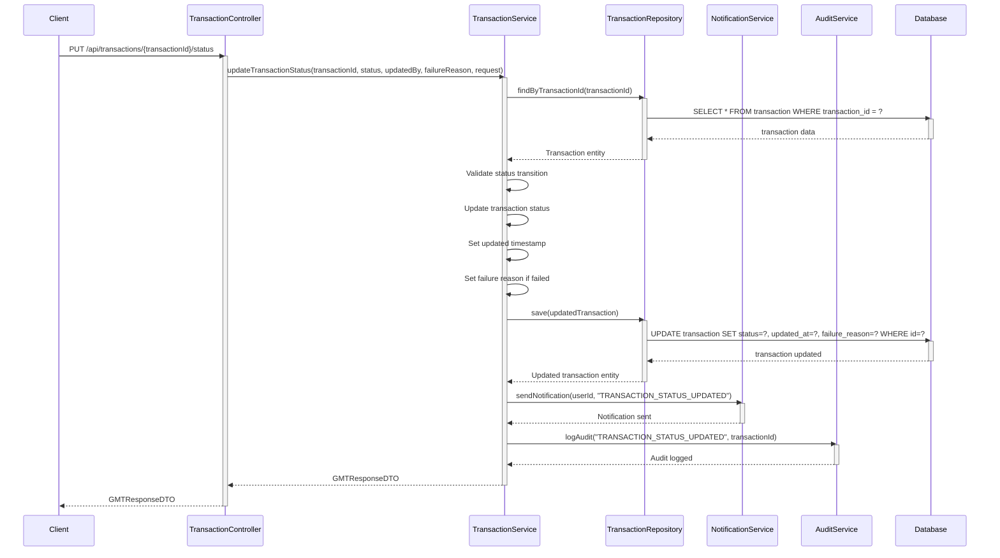
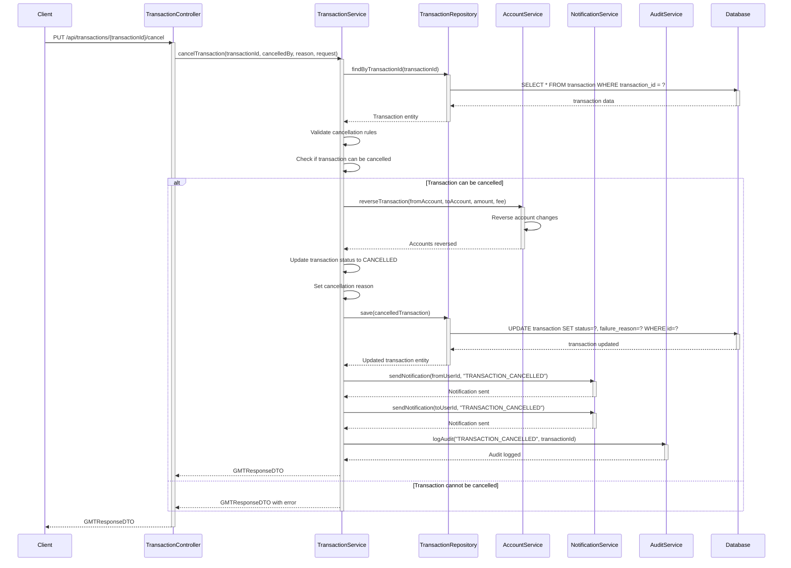
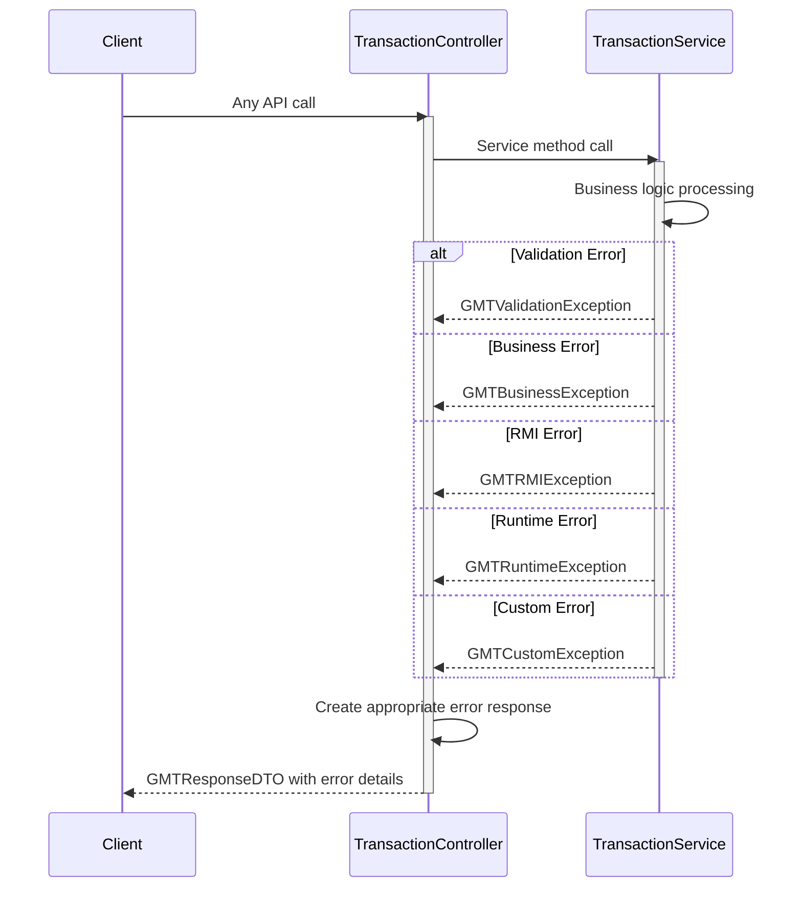

# Transaction Service - Гүйлгээний үйлчилгээ Sequence Diagrams

Энэ файл нь Transaction Service-ийн үндсэн бизнес процессуудын sequence diagram-уудыг агуулна.

## 1. Гүйлгээ хийх (Process Transfer)

## 2. Банк хоорондын гүйлгээ (Inter-Bank Transfer)

## 3. Банк хоорондын гүйлгээний төлөв шинэчлэх (Update Inter-Bank Status)

## 4. Хадгаламж хийх (Process Deposit)

## 5. Гүйлгээний мэдээлэл авах (Get Transaction by ID)

## 6. Хэрэглэгчийн гүйлгээнүүд (Get Transactions by User)

## 7. Гүйлгээний төлөв шинэчлэх (Update Transaction Status)

## 8. Гүйлгээ цуцлах (Cancel Transaction)

## 9. Алдааны боловсруулалт (Error Handling)

## Үндсэн онцлогууд

- **Гүйлгээ хийх**: Дотоод данс хоорондын шилжүүлэг
- **Банк хоорондын гүйлгээ**: SWIFT/BIC кодын дагуу гадаад банк руу
- **Хадгаламж**: Данс руу мөнгө хадгалах
- **Төлөв шинэчлэх**: Гүйлгээний төлөвийг шинэчлэх
- **Гүйлгээ цуцлах**: Гүйлгээг цуцлах, дансны мөнгийг буцаах
- **Мэдээлэл**: Хэрэглэгчид мэдэгдэх
- **Аудит**: Бүх үйл ажиллагааг бүртгэх
- **Алдааны боловсруулалт**: Янз бүрийн алдааг зохицуулах

## API Endpoint-ууд

- `POST /api/transactions` - Гүйлгээ хийх
- `POST /api/transactions/inter-bank` - Банк хоорондын гүйлгээ
- `PUT /api/transactions/inter-bank/{transactionId}/status` - Банк хоорондын төлөв шинэчлэх
- `POST /api/transactions/deposit` - Хадгаламж хийх
- `GET /api/transactions/{transactionId}` - Гүйлгээний мэдээлэл авах
- `GET /api/transactions/user/{userId}` - Хэрэглэгчийн гүйлгээнүүд
- `PUT /api/transactions/{transactionId}/status` - Гүйлгээний төлөв шинэчлэх
- `PUT /api/transactions/{transactionId}/cancel` - Гүйлгээ цуцлах
